# 🚨 Экстренная инструкция: Локальный запуск проекта

> **Причина:** Сервер на Render начал работать нестабильно. Данная инструкция позволит запустить проект локально и продемонстрировать работоспособность приложения независимо от состояния Render.

---

## 📋 Оглавление

1. [Предварительные требования](#предварительные-требования)
2. [Подготовка окружения](#подготовка-окружения)
3. [Запуск бэкенда](#запуск-бэкенда)
4. [Запуск фронтенда](#запуск-фронтенда)
5. [Проверка результата](#проверка-результата)
6. [⚠️ Важные предупреждения](#важные-предупреждения)
7. [Возможные проблемы и решения](#возможные-проблемы-и-решения)

---

## Предварительные требования

- ✅ Установленный **Node.js** и **npm**
- ✅ Установленный **VSCode**
- ✅ Доступ к **ветке `develop`**
- ✅ Файлы `.env` для бэкенда и фронтенда (получить у руководителя в личных сообщениях)

---

## Подготовка окружения

### Шаг 1: Переключение на ветку `develop`

Убедитесь, что вы находитесь в ветке `develop`:

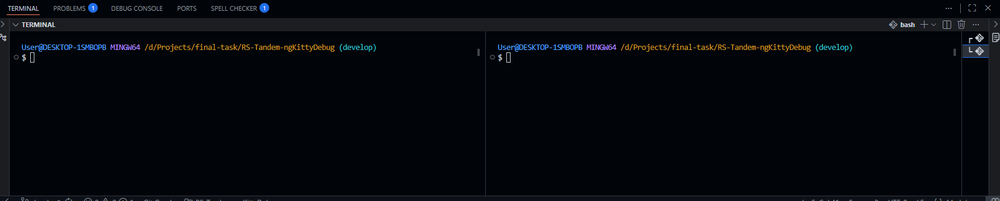

### Шаг 2: Открытие двух терминалов

Рекомендуется разделить терминал для удобства работы. Сплит терминала доступен в VSCode:

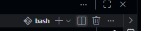

Это позволит одновременно видеть вывод бэкенда и фронтенда.

### Шаг 3: Навигация по папкам

| Терминал 1 (Бэкенд) | Терминал 2 (Фронтенд) |
|---------------------|----------------------|
| `cd backend`        | `cd frontend`        |

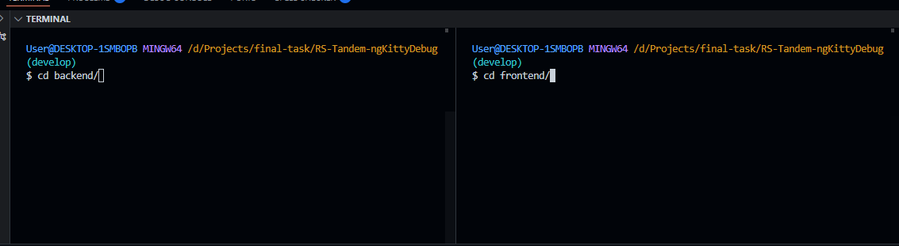

---

## Запуск бэкенда

### Шаг 4: Установка зависимостей

В терминале бэкенда выполните:

```bash
npm ci
```

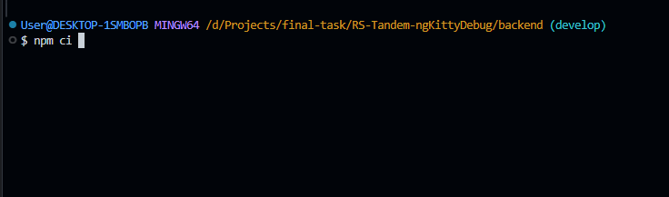

> `npm ci` устанавливает зависимости строго по `package-lock.json`, что гарантирует идентичность окружений.

### Шаг 5: Генерация типов Prisma

После установки зависимостей сгенерируйте типы и функции для Prisma:

```bash
npm run generate:dev
```

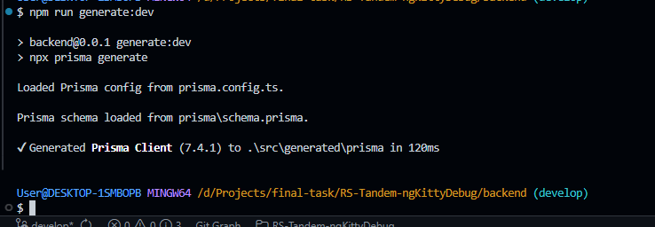

### Шаг 6: Настройка `.env` файлов

> **Важно:** Файлы `.env` содержат конфиденциальные данные. Не передавайте их третьим лицам!

Создайте или замените файлы `.env` в соответствующих папках:

**Backend (`backend/.env`):**

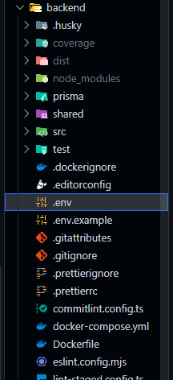

**Frontend (`frontend/.env`):**

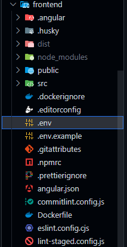

> Файлы `.env` были отправлены лично. В них содержатся комментарии к каждой переменной.

### Шаг 7: Запуск бэкенда

Запустите бэкенд командой:

```bash
npm start
```

После успешного билда бэкенд подключится к **Supabase** и запустится:

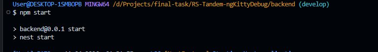

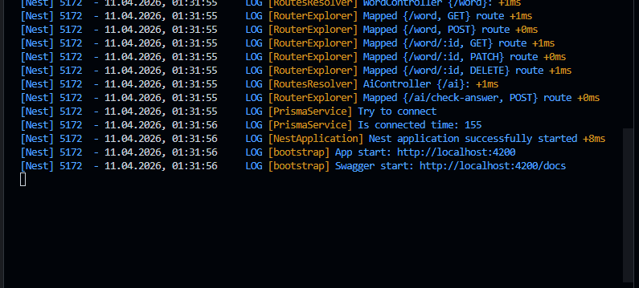

---

## Запуск фронтенда

### Шаг 8: Запуск фронтенда

Во втором терминале (папка `frontend`) выполните:

```bash
npm start
```

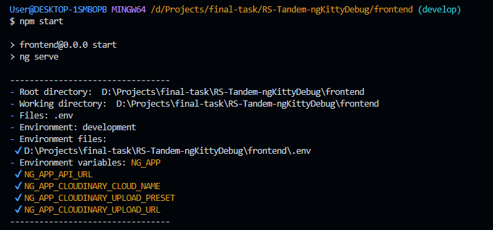

---

## Проверка результата

### Шаг 9: Успешный запуск

Если всё прошло успешно, оба терминала должны отображать сообщения о успешном старте:

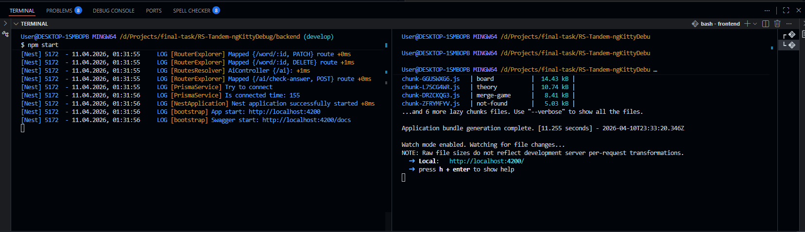

Теперь вы можете продемонстрировать работоспособность приложения **независимо от состояния Render**.

---

## ⚠️ Важные предупреждения

| ⛔ | ПРЕДУПРЕЖДЕНИЕ |
|---|----------------|
| 🔒 | **НИКОМУ не передавайте `.env` файлы!** В них содержатся секреты, которые могут скомпрометировать базу данных и бэкенд. |
| 💀 | Данная инструкция **не спасает от падения Supabase**. Если Supabase будет недоступен, бэкенд не сможет подключиться к базе данных. |
| 🛡️ | Берегите секреты как зеницу ока! |

---

## Возможные проблемы и решения

| Проблема | Решение |
|----------|---------|
| Ошибки линтов после установки зависимостей | Перезапустите VSCode и повторно откройте терминалы |
| Ошибка подключения к Supabase | Проверьте содержимое `.env` файла бэкенда и доступность Supabase |
| Зависимости не установились | Убедитесь, что находитесь в правильной папке и используете `npm ci` |

---

> 📝 **Примечание:** Данная инструкция является временным решением на случай нестабильной работы Render. Рекомендуется регулярно проверять её актуальность.

---