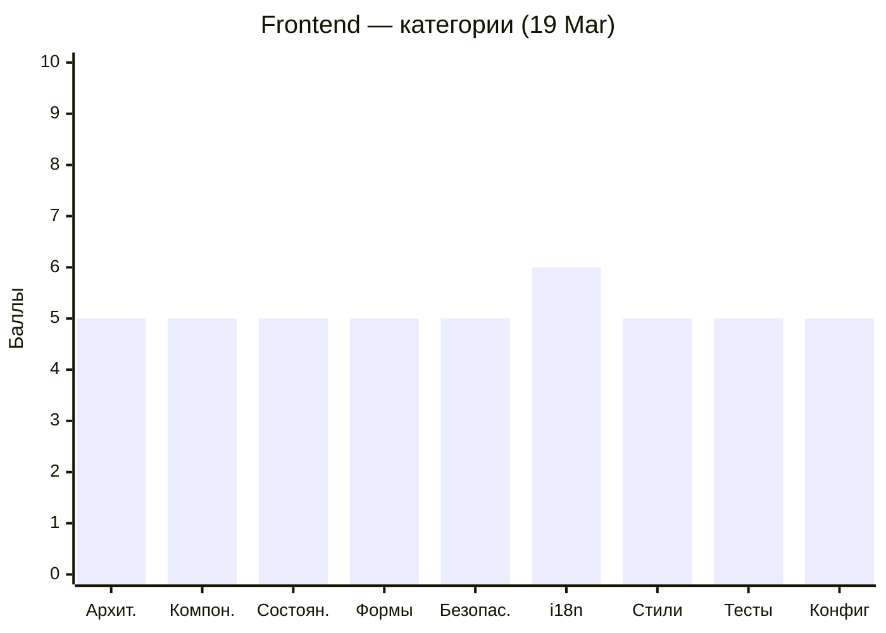
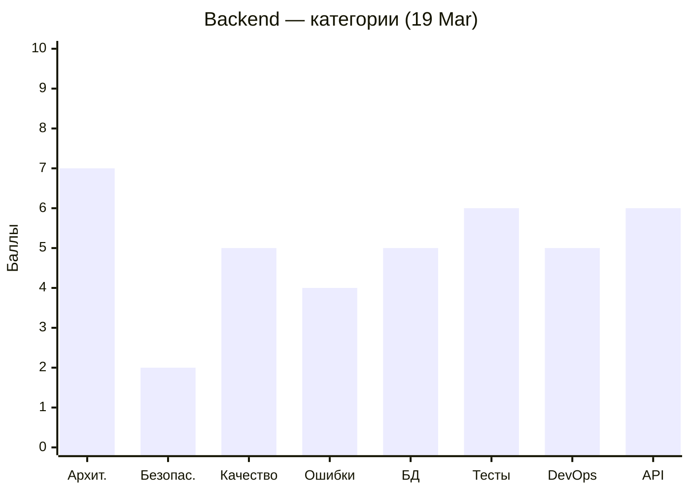

# Code Quality Status — MeowVault

Последнее ревью: **2026-03-19**

---

## 📝 Аналитическое резюме

### Текущее состояние

Проект расширяется, но качество падает. Frontend — **5.0/10** (было 5.5), Backend — **5.5/10** (было 6.0). Команда активно добавляет функциональность — страница регистрации с формой, профиль пользователя с компонентами, KeyStorage CRUD на бэкенде — но каждая новая фича приносит новые CRITICAL/MAJOR замечания, а старые не закрываются. Количество issues выросло: Frontend 3/14/11 (было 2/7/7), Backend 5/13/11 (было 3/8/5).

### Недавний прогресс (16 Mar → 19 Mar)

Frontend потерял **-0.5 балла**. Формально сделано много: регистрация с формой и валидаторами, профиль с `ProfileSidebar`/`ProfileStats`/`RecentActivity`/`UserStore`, исправлен `provideTranslocoPersistLang`, добавлен `OnPush` в три компонента. Но `RegistrationService` дублирует `AuthService.register()` — после регистрации пользователь не авторизован (CRITICAL). Форма регистрации без `isLoading`, без навигации, с `throw new Error` без catch. Профиль — захардкоженные данные на английском. Main — 6 карточек `"Replace me"`.

Backend потерял **-0.5 балла**. Исправлены regex-паттерны (`EMAIL_PATTERN`, `USER_PATTERN`) — единственные два RESOLVED за цикл. Но появились новые: `KeyStorageController` полностью открыт через `@Public()` (CRITICAL), `githubOauth` upsert без обработки P2002 (CRITICAL), `refresh()` не включает `provider` в payload. OAuth-пользователи не отсекаются в `updateUser`/`updatePassword`.

### Общий прогресс

За три цикла ревью (09 Mar → 16 Mar → 19 Mar) динамика нелинейная:
- **Frontend:** 4.5 → 5.5 → 5.0. Рост на втором цикле (guards, interceptor, session restore) был реальным прогрессом. Третий цикл — откат: расширение функциональности без закрытия долга.
- **Backend:** 6.0 → 6.0 → 5.5. Стагнация на втором цикле сменилась снижением на третьем. Четыре CRITICAL-замечания из первого ревью до сих пор открыты (refresh token в БД, `verifyAsync` try/catch, `.env.example` с паролем, ForbiddenException вместо Unauthorized).
- **Общий тренд:** количество замечаний растёт быстрее, чем закрывается. Frontend: 22 → 16 → 28. Backend: 18 → 16 → 29. Команда генерирует технический долг быстрее, чем его погашает.

### Впечатление

Главный системный паттерн команды — **feature-first, quality-never**. Новые страницы и модули создаются активно, но ни один CRITICAL из первого ревью (09 Mar) не закрыт за 10 дней. Это не недостаток навыков — regex-паттерны исправлены корректно, `provideTranslocoPersistLang` починен с `useFactory`, OnPush добавляется точечно. Команда умеет исправлять, но выбирает не исправлять.

Второй паттерн — **copy-paste без понимания контекста**. `RegistrationService` скопирован с `AuthService`, но с отдельным `accessToken` signal. Карточки на Main — 6 идентичных HTML-блоков вместо `@for`. Профиль — захардкоженные числа и строки вместо данных из API. `KeyStorageController` получил `@Public()` по шаблону, не задумываясь о последствиях для POST/DELETE.

Третий паттерн — **опечатки как индикатор**. `LaguageSwitcher`, `AppTosterService`, `gtUserProfile`, `update-avater.dto.ts`, `mismathPassword`, `ThemeSwither` — шесть опечаток в именах классов, файлов и ключей перевода. Ни одна не исправлена за три ревью. Это говорит об отсутствии привычки перечитывать свой код перед коммитом.

Рекомендация: ввести правило — **0 новых фич до закрытия всех CRITICAL**. Сейчас открыто 8 критических замечаний (3 frontend + 5 backend). Каждое — конкретная задача на 15-60 минут.

---

### Пожелания участникам

> ℹ️ *Индивидуальные наблюдения формируются на основе анализа git blame и PR-истории во время ревью. Секция обновляется при каждом ревью — см. REVIEW_PLAN.md, Шаг 4.2.*

#### Мария — [WhaleisaJoy](https://github.com/WhaleisaJoy)

**Что делала в этом цикле:** User Profile — реализовала `ProfileSidebar`, `ProfileStats`, `RecentActivity`, `UserStore`. Это уже не заглушка, а полноценная страничная структура с компонентной декомпозицией.

**Паттерны:** Архитектура профиля сделана правильно — отдельные компоненты, выделенный store. Но данные захардкожены: `"Racing"`, `"Puzzle"`, `127`, `45,820` — всё статично и на английском, без i18n. Компоненты `UserProfile`, `ProfileSidebar`, `ProfileStats`, `RecentActivity` без `OnPush`. Опечатка `mismathPassword` в переводах профиля.

**Совет:** Подключи данные профиля к реальному API (хотя бы username/email из `UserService`). Добавь `OnPush` во все четыре компонента — это буквально одна строка в каждом `@Component`. И исправь `mismathPassword` → `mismatchPassword` в JSON-файлах переводов.

---

#### Алена — [Alena1409](https://github.com/Alena1409)

**Что делала в этом цикле:** Merge game (в процессе). Замечания по Login и Interceptor из предыдущих ревью не тронуты.

**Паттерны:** Login по-прежнему проверяет HTTP `403` вместо `401`. `getInputError` вызывается как метод в шаблоне (не `computed()`). `isRefreshing` и `refreshSubject` в `AuthService` остаются `public`. Интерцептор — ноль значимых тестов. Эти замечания открыты с 09 Mar.

**Совет:** Прежде чем углубляться в игровую логику, закрой два замечания по Login: (1) `403` → `401` — одна строка, (2) `getInputError` → `computed()` — 10 строк. Это поднимет оценки "Формы" и "Компоненты" сразу.

---

#### Алексей — [AlexGorSer](https://github.com/AlexGorSer)

**Что делал в этом цикле:** Исправил `EMAIL_PATTERN` и `USER_PATTERN` (два RESOLVED). Добавил `KeyStorageModule` с полным CRUD и Swagger. Добавил GitHub OAuth с upsert.

**Паттерны:** Regex-паттерны исправлены корректно — значит, замечания читаются. Но `KeyStorageController` помечен `@Public()` целиком — POST и DELETE открыты анонимно. `githubOauth` upsert обновляет username/email без обработки P2002 — при коллизии будет 500. `refresh()` не передаёт `provider` в payload — после обновления токена авторизация OAuth-пользователей может сломаться. `updateUser`/`updatePassword` не проверяют `provider` — OAuth-пользователь получает "неверный пароль" вместо "операция недоступна". Четыре CRITICAL из первого ревью (refresh token в БД, `verifyAsync` try/catch, `.env.example`, 403→401) не тронуты.

**Совет:** Ты единственный backend-разработчик — вся ответственность за безопасность на тебе. Начни с `@Public()` на `KeyStorageController` — убери декоратор с класса, это 1 строка. Затем `verifyAsync` try/catch — 5 строк. Затем `provider: true` в select при refresh — 1 строка. Три фикса, 7 строк, три CRITICAL/MAJOR закрыты.

---

#### Надежда — [kozochkina82](https://github.com/kozochkina82)

**Что делала в этом цикле:** Обновила Main page — добавила описание проекта, секцию с карточками игр, кнопку "Начать".

**Паттерны:** Main уже не пустая заглушка `mainWorks` — прогресс есть. Но 6 карточек — это 6 копипастных HTML-блоков с `"Replace me"` внутри вместо `@for` по массиву данных. Кнопка "Начать" без `routerLink` и без `(click)` — мёртвый элемент. Внешний CDN URL для иконки нарушает CSP. Страница содержит `OnPush` — это плюс.

**Совет:** Замени 6 копипастных блоков на массив объектов + `@for` — это уберёт сразу MAJOR-замечание и покажет владение Angular control flow. Добавь `routerLink` на кнопку "Начать". Сохрани иконку локально в `public/assets/icons/` вместо CDN.

---

#### Оксана — [Oksi2510](https://github.com/Oksi2510)

**Что делала в этом цикле:** Реализовала форму регистрации с username, email, password, passwordRepeat, кастомным `passwordsValidator`, Taiga UI компонентами и обработкой ошибок. Добавила `EyeCompassDirective`.

**Паттерны:** Форма регистрации — серьёзная работа: Reactive Forms, кастомный валидатор, Taiga UI интеграция. Но критическая архитектурная ошибка: создан отдельный `RegistrationService` вместо использования `AuthService.register()` — после регистрации `isLoggedIn` = `false`. `submit()` содержит `throw new Error` без внешнего catch (unhandled rejection), нет `isLoading` (двойная отправка), нет навигации после успеха. `autocomplete="current-password"` вместо `"new-password"`. `EyeCompassDirective` ищет `[data-pupil]`, но в шаблоне используется `#pupil` — директива не активируется.

**Совет:** Удали `RegistrationService` и используй `AuthService.register()` — это уберёт CRITICAL. Добавь `isLoading = signal(false)`, `this.router.navigate(...)` после успеха, замени `throw new Error` на `return` — три строки, ещё один CRITICAL закрыт. По `EyeCompassDirective`: если она нужна — замени `[data-pupil]` на `#pupil` selector, если нет — удали файл.

---

#### Павел — [pavelkuvsh1noff](https://github.com/pavelkuvsh1noff)

**Что делал в этом цикле:** Видимых изменений в коде из области ответственности нет. Замечания из предыдущих ревью не тронуты. Decrypto game (в процессе).

**Паттерны:** Все шесть замечаний по его коду открыты с 09 Mar (три ревью подряд): `LaguageSwitcher` (опечатка), `AppTosterService` (опечатка), `ThemeService` с прямым `localStorage` (CRITICAL SSR-краш), `ThemeSwitcher` без `[checked]`, мутабельное состояние вместо signals в `LaguageSwitcher`, `console.log` в header. Тесты — smoke-уровень.

**Совет:** Три ревью, ноль исправлений — это уже паттерн. `ThemeService` с `localStorage` при инициализации — CRITICAL, который блокирует SSR. Исправление: `inject(DOCUMENT).defaultView?.localStorage` — одна строка. Переименование `LaguageSwitcher` и `AppTosterService` — 15 минут через Find & Replace. Добавь `[checked]="themeService.theme() === ThemeNames.Dark"` в `ThemeSwitcher` — одна строка. Четыре замечания, 30 минут работы.

---

## Frontend (Angular)

```mermaid
xychart-beta
    title "Frontend — тренд оценки"
    x-axis ["09 Mar", "16 Mar", "19 Mar"]
    y-axis "Баллы" 0 --> 10
    line [4.5, 5.5, 5.0]
```



| Severity | 09 Mar | 16 Mar | 19 Mar | Δ |
|----------|--------|--------|--------|---|
| 🔴 Critical | 6 | 2 | 3 | ↑1 |
| 🟠 Major | 8 | 7 | 14 | ↑7 |
| 🟡 Minor | 8 | 7 | 11 | ↑4 |

---

## Backend (NestJS)

```mermaid
xychart-beta
    title "Backend — тренд оценки"
    x-axis ["09 Mar", "16 Mar", "19 Mar"]
    y-axis "Баллы" 0 --> 10
    line [6.0, 6.0, 5.5]
```



| Severity | 09 Mar | 16 Mar | 19 Mar | Δ |
|----------|--------|--------|--------|---|
| 🔴 Critical | 4 | 3 | 5 | ↑2 |
| 🟠 Major | 9 | 8 | 13 | ↑5 |
| 🟡 Minor | 6 | 5 | 11 | ↑6 |
