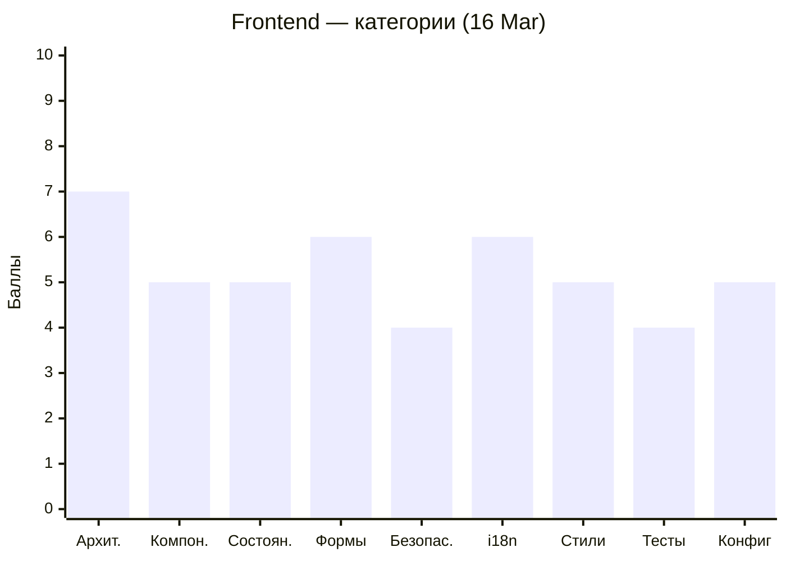
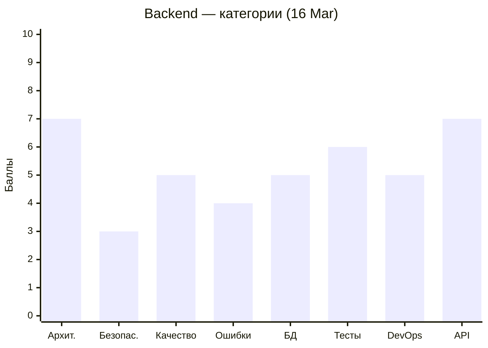

# Code Quality Status — MeowVault

Последнее ревью: **2026-03-16**

---

## 📝 Аналитическое резюме

### Текущее состояние

Проект живёт и развивается. Frontend — **5.5/10**, Backend — **6.0/10**. Базовая архитектура выстроена корректно: маршрутизация, guards, interceptor, session restore — всё на месте. Однако значительная часть мажорных и критических замечаний кочует из ревью в ревью без изменений, что тормозит рост оценок.

### Недавний прогресс (09 Mar → 16 Mar)

Frontend прибавил **+1.0 балл** — это хороший результат за неделю. Сделана наиболее архитектурно сложная часть: `AuthGuard`, `GuestGuard`, HTTP Interceptor с очередью pending-запросов, `provideAppInitializer` для восстановления сессии. Это показывает, что команда способна брать и закрывать сложные задачи. Backend остался на **6.0** — issues снизились, но незначительно. Критические проблемы безопасности (refresh token не хранится в БД, `verifyAsync` без `try/catch`) не тронуты с самого первого ревью.

### Общий прогресс

За два цикла ревью команда прошла путь от "работает, но небезопасно и архитектурно сыро" к "архитектурно правильно, но требует доработки в деталях". Ключевые Angular-паттерны (functional guards, interceptor, app initializer, signals) освоены и применены. Backend держится стабильно — структура модульная, Swagger подключён, JWT-стратегия в целом корректна.

### Впечатление

Команда движется в правильном направлении, и это видно. Когда задача берётся — она делается качественно. Но есть устойчивый паттерн: замечания по безопасности и "простые" задачи (OnPush везде, опечатки в именах классов `LaguageSwitcher`, `AppTosterService`) игнорируются несколько итераций подряд. Это не вопрос сложности — это вопрос приоритизации. Советую завести отдельный тикет на каждое CRITICAL/MAJOR замечание и не начинать новые фичи, пока они не закрыты.

Ещё один момент: тесты добавляются, но остаются поверхностными (smoke-уровень). Интерцептор — один из самых критических модулей — не покрыт ни одним значимым тестом. Тест, который проверяет только `toBeTruthy()`, не защищает от регрессий.

---

### Пожелания участникам

> ℹ️ *Индивидуальные наблюдения формируются на основе анализа git blame и PR-истории во время ревью. Секция обновляется при каждом ревью — см. REVIEW_PLAN.md, Шаг 4.2.*

| Участник | GitHub | Наблюдения | Советы |
|----------|--------|------------|--------|
| Мария | [WhaleisaJoy](https://github.com/WhaleisaJoy) | — | — |
| Алена | [Alena1409](https://github.com/Alena1409) | — | — |
| Алексей | [AlexGorSer](https://github.com/AlexGorSer) | — | — |
| Надежда | [kozochkina82](https://github.com/kozochkina82) | — | — |
| Оксана | [Oksi2510](https://github.com/Oksi2510) | — | — |
| Павел | [pavelkuvsh1noff](https://github.com/pavelkuvsh1noff) | — | — |

---

## Frontend (Angular)

```mermaid
xychart-beta
    title "Frontend — тренд оценки"
    x-axis ["09 Mar", "16 Mar"]
    y-axis "Баллы" 0 --> 10
    line [4.5, 5.5]
```



| Severity | 09 Mar | 16 Mar | Δ |
|----------|--------|--------|---|
| 🔴 Critical | 6 | 2 | ↓4 |
| 🟠 Major | 8 | 7 | ↓1 |
| 🟡 Minor | 8 | 7 | ↓1 |

---

## Backend (NestJS)

```mermaid
xychart-beta
    title "Backend — тренд оценки"
    x-axis ["09 Mar", "16 Mar"]
    y-axis "Баллы" 0 --> 10
    line [6.0, 6.0]
```



| Severity | 09 Mar | 16 Mar | Δ |
|----------|--------|--------|---|
| 🔴 Critical | 4 | 3 | ↓1 |
| 🟠 Major | 9 | 8 | ↓1 |
| 🟡 Minor | 6 | 5 | ↓1 |
