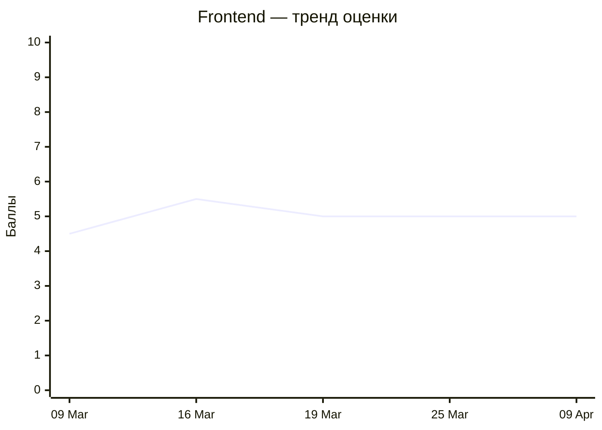
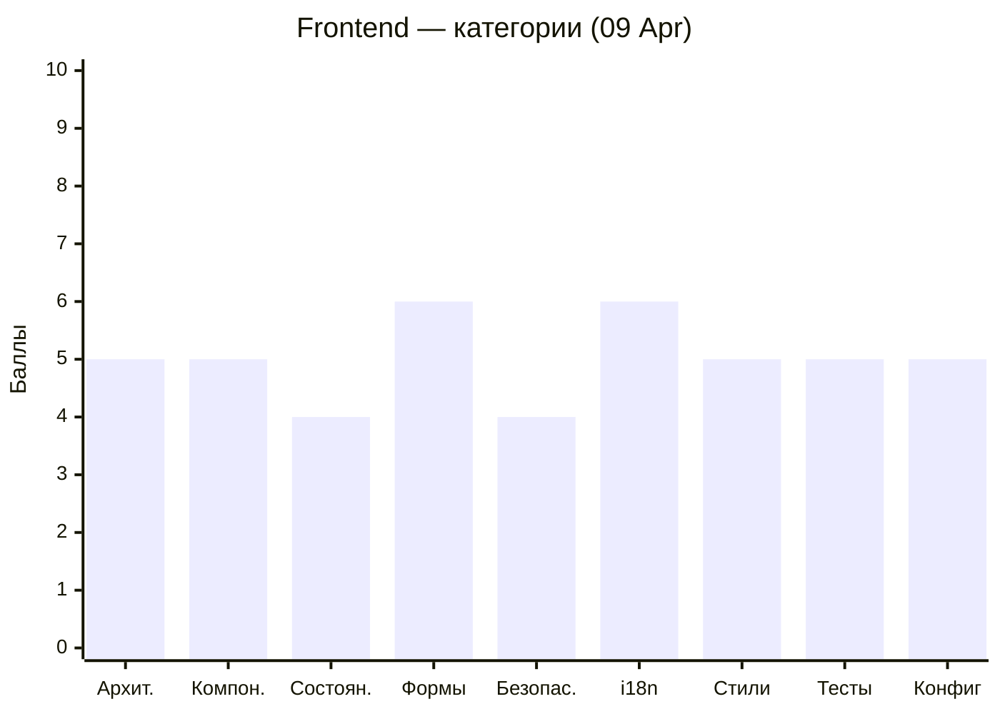
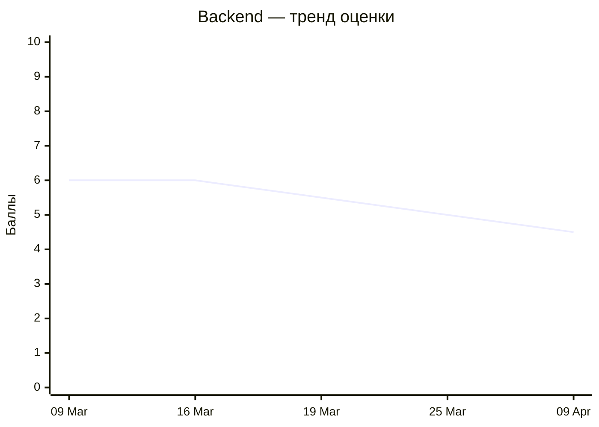
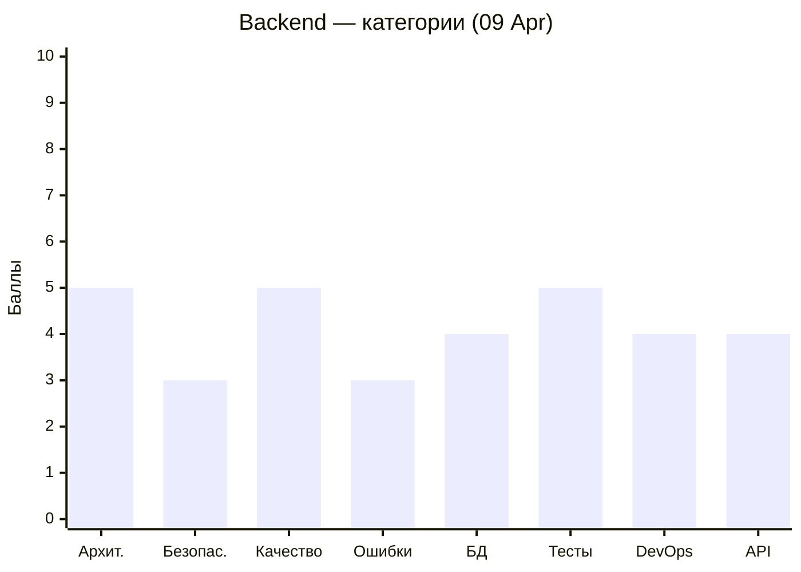

# Code Quality Status — MeowVault

Последнее ревью: **2026-04-09**

---

## 📝 Аналитическое резюме

### Текущее состояние

Frontend — **5.0/10** (без изменений), Backend — **4.5/10** (↓ с 5.0). За цикл 25 Mar → 09 Apr frontend показал рекордные 11 закрытых замечаний: удалён `RegistrationService` (CRITICAL), добавлена проверка `isLoggedIn()` в Header, убраны `"Replace me"` заглушки. Однако новые игры (`CitiesGame`, `Hangman`, `EventLoopGame`) принесли серьёзные проблемы: `DecryptoAiService` с `@huggingface/inference` вызывается прямо из браузера с пустым токеном (CRITICAL), 5 незакрытых HTTP-подписок, `[OAuth-Debug]` console.warn в production. Backend потерял балл — найдены два новых CRITICAL в auth: `registration()` без перехвата `P2002` и `githubOauth` перезаписывает `email`. Frontend: 4 CRITICAL / 21 MAJOR / 16 MINOR. Backend: 6 CRITICAL / 15 MAJOR / 11 MINOR.

### Недавний прогресс (25 Mar → 09 Apr)

**Frontend** держит 5.0/10 при росте долга. RESOLVED за цикл (рекорд): `RegistrationService` удалён, Header с `isLoggedIn()`, дубль `LoginResponse` убран, `throw new Error` → `return`, Login `403`→`401`, `console.log` в `decrypto.ts`, дублирующий HTTP-запрос, захардкоженные строки в UserProfile, `"Replace me"` карточки на Main. Это настоящий прогресс в архитектуре. Но новый код (#204 `EventLoopGame`, #199 `CitiesGame`, #210 `DecryptoAiService`) принёс 3 CRITICAL и 12 MAJOR. Особенно критично: `DecryptoAiService` с пустым HuggingFace токеном в браузере и 5 незакрытых RxJS-подписок в новых компонентах.

**Backend** теряет **-0.5 балла** (5.0 → 4.5). RESOLVED: только `AI_KEY`/`AI_URL`/`AI_MODEL` в `.env.example`. Два новых CRITICAL в auth: `registration()` не обёртывает `prisma.user.create` в `try/catch` — race condition с P2002 → 500 вместо 409; `githubOauth` обновляет `email` из GitHub-профиля при каждом логине — нарушение идентичности. Четыре CRITICAL из первого ревью (12 Mar) остаются открытыми без изменений. Появился PR #216 (open) с фиксами багов AI — надо дождаться мержа.

### Общий прогресс

За пять циклов ревью (09 Mar → 16 Mar → 19 Mar → 25 Mar → 09 Apr) динамика:
- **Frontend:** 4.5 → 5.5 → 5.0 → 5.0 → 5.0. Плато три цикла подряд. MAJOR-долг: 8 → 7 → 14 → 18 → 21 — стабильный рост.
- **Backend:** 6.0 → 6.0 → 5.5 → 5.0 → 4.5. Устойчивое снижение пятый цикл. CRITICAL: 4 → 3 → 5 → 5 → 6 — никогда не уменьшалось.
- **Общий тренд:** CRITICAL из первого ревью backend (09 Mar) — `refresh token в БД`, `verifyAsync try/catch`, `.env.example пароль` — открыты ровно месяц. Frontend: `ThemeService localStorage` и `LaguageSwitcher/AppTosterService` опечатки — месяц. Это уже не технический долг — это игнорирование ревью.

### Впечатление

**Паттерн 1 — feature-first без возврата к долгу.** За цикл влито 10+ PRs с новым кодом, закрыто 0 backend CRITICAL. Исключение: Мария закрыла 10 фронтенд-замечаний в одном цикле — доказательство, что команда умеет возвращаться к долгу при желании.

**Паттерн 2 — новый код копирует антипаттерны.** `CitiesGame` повторяет паттерн незакрытых подписок из `Header`. `GameComponent` (Hangman) повторяет `localStorage` без `DOCUMENT` из `ThemeService`. `DecryptoAiService` — третий `console.error` в production после `Header` и `Decrypto`. Команда не читает ревью перед написанием нового кода.

**Паттерн 3 — backend игнорируется.** За весь период backend закрыл суммарно 6 замечаний (из 50+ поднятых). Фронтенд за последний цикл закрыл 11. Асимметрия говорит о том, что кто отвечает за backend — не воспринимает ревью как actionable задачи.

Рекомендация: каждый PR должен содержать хотя бы одну строку в описании: "Закрывает замечание X из code-review-backend/frontend.md". Это создаёт трассируемость и меняет культуру.

---

### Пожелания участникам

> ℹ️ *Индивидуальные наблюдения формируются на основе анализа git log и PR-истории. Секция обновляется при каждом ревью — см. REVIEW_PLAN.md, Шаг 4.2.*

#### Мария — [WhaleisaJoy](https://github.com/WhaleisaJoy)

**Что делала в последнем цикле:** PR #244 — fix responsive (responsive-фиксы компонентов), PR #239 — fix close dialog + vscode settings, PR #204 — `EventLoopGame` (полноценная мини-игра с диалогами, анимацией, таймером). Самый активный участник по frontend за цикл. PR #202 — статистика пользователя в профиле.

**Паттерны ошибок:** `EventLoopGame` и его компоненты (`game-start-dialog`, `game-end-dialog`, `game-cat-indicator`) добавлены с `OnPush`, что хорошо. Но `ProfileSidebar.onFileSelected()` — подписка без `takeUntilDestroyed` при загрузке аватара. Опечатка `mismathPassword` в переводах — пятый цикл без исправления. `accountForm effect()` с `isAccountEditMode()` как лишней зависимостью — не исправлено три цикла.

**Совет:** `onFileSelected()` — добавь `inject(DestroyRef)` и `takeUntilDestroyed` — одна строка в pipe, это MAJOR. Исправь `mismathPassword` → `mismatchPassword` в двух JSON-файлах — это буквально одна буква в двух местах, замечание открыто 30+ дней.

---

#### Алена — [Alena1409](https://github.com/Alena1409)

**Что делала в последнем цикле:** PR #236 — fix start game (fix bugs в merge game), PR #216 (open) — Fix/backend fix bugs according ai. Работает над исправлениями, но PR ещё не влит.

**Паттерны ошибок:** `AiService.checkAnswer` с `catch {}` без параметра — три цикла не исправлено. `CheckAnswerDto.personality: string` вместо `PersonalityType` — два цикла. AI-эндпоинт без Rate Limiting — CRITICAL с точки зрения расходов на Groq. `MergeGame`/`Board`/`Quiz` — захардкоженные роуты `/merge-game/settings` и `/merge-game/board` — новое MAJOR.

**Совет:** PR #216 — убедись, что он включает: `catch {}` → `catch (error) { if (error instanceof HttpException) throw error; }` и `ParseIntPipe` для `dataId`/`wordId`/`page`/`limit`. Это то, что ревью ждёт уже два цикла. Замени захардкоженные строки маршрутов на enum-константы — один рефакторинг закроет три MAJOR сразу.

---

#### Алексей — [AlexGorSer](https://github.com/AlexGorSer)

**Что делал в последнем цикле:** PR #238 — feat: add electron (десктоп-обёртка), PR #229 — Docker Compose files, PR #223 — delete console.log from decrypto game, PR #205 — unit tests. Закрыл `console.log` в decrypto — хороший сигнал. PR #216 (open) — fix backend bugs.

**Паттерны ошибок:** Два новых CRITICAL в `auth.service.ts` — `registration()` без `P2002` и `githubOauth` с обновлением email. `RolesGuard` с `ImATeapotException` и сравнением `=== roles[]` — два цикла. `verifyAsync` без `try/catch` — пять циклов. Концентрация нерешённых CRITICAL по auth — самый высокий backend-долг в команде.

**Совет:** PR #216 — приоритизируй: 1) `prisma.user.create` try/catch для P2002, 2) убрать `email` из `update`-ветки githubOauth, 3) `verifyAsync` try/catch. Три фикса, один файл (`auth.service.ts`). `RolesGuard` — два фикса в одном файле, 5 минут работы — сделай отдельным коммитом.

---

#### Надежда — [kozochkina82](https://github.com/kozochkina82)

**Что делала в последнем цикле:** PR #225 — hangman adaptive (адаптивная верстка игры Виселица), PR #221 — fix pictures, PR #196 — `HangmanGame` компонент. Активная работа над новой игрой — объёмный вклад.

**Паттерны ошибок:** `GameComponent` (Hangman) использует `localStorage` напрямую без `inject(DOCUMENT)` — CRITICAL SSR, тот же паттерн что в `ThemeService`. `Hangman` компоненты без `OnPush` (самого `hangman.ts`). `styleUrls` вместо `styleUrl` в `hangman.ts`. `HangmanGame` тест — только smoke. Кнопка "Начать" без действия — пятый цикл.

**Совет:** В `game.component.ts:96,104` замени `localStorage` на `inject(DOCUMENT).defaultView?.localStorage` — это CRITICAL, три строки. Добавь `OnPush` в `hangman.ts`. Исправь `styleUrls` → `styleUrl`. Кнопку "Начать" добавь `routerLink="/login"` — одна строка, пятый цикл открыто.

---

#### Оксана — [Oksi2510](https://github.com/Oksi2510)

**Что делала в последнем цикле:** PR #230 — Fix/frontend fix cities game bugs, PR #199 — `CitiesGame` (создание новой игры). Большой вклад — полноценная игровая логика с `forkJoin` для загрузки данных.

**Паттерны ошибок:** `CitiesGame` — `forkJoin` и `getUser()` без `takeUntilDestroyed` (CRITICAL утечки памяти), `CommonModule` вместо точечных импортов (MAJOR bundle size), `styleUrls` вместо `styleUrl`. `provideTranslocoPersistLang` с прямым `localStorage` в `app.config.ts` — MAJOR, добавлено в этом же цикле. `RegistrationService` и `throw new Error` из предыдущих ревью — RESOLVED (хорошо!).

**Совет:** В `cities-game.ts` в двух `subscribe()` добавь `.pipe(takeUntilDestroyed(this.destroyRef))` — `this.destroyRef = inject(DestroyRef)` уже задеклариван. Это уберёт CRITICAL. Замени `CommonModule` на `@if`/`@for` + конкретные импорты — Angular 17+ предпочитает встроенный control flow.

---

#### Павел — [pavelkuvsh1noff](https://github.com/pavelkuvsh1noff)

**Что делал в последнем цикле:** PR #243 — fix mistakes in labels (исправления в игре Decrypto), PR #210 — `DecryptoAiService` (AI-интеграция через HuggingFace Inference). Исправил опечатки в лейблах — это прогресс.

**Паттерны ошибок:** `DecryptoAiService` вызывает `@huggingface/inference` напрямую из браузера с пустым токеном `''` — CRITICAL, нельзя выпускать. `console.error('Ошибка API:', err)` — отладочный вывод в production, русский текст. `DecryptoGameService` — 6 публичных мутабельных массивов — пять циклов. `ThemeService.changeTheme()` с прямым `localStorage` — CRITICAL пять циклов. `LaguageSwitcher`/`AppTosterService` опечатки — пять циклов.

**Совет:** `DecryptoAiService` — нельзя мержить с вызовом HuggingFace из браузера. Либо перенести на backend (правильно), либо временно убрать сервис до готовности backend. `console.error('Ошибка API:')` — удали строку. Затем — `ThemeService.changeTheme()`: `localStorage.setItem` → `this.storage?.setItem` — добавь `private readonly storage = inject(DOCUMENT).defaultView?.localStorage` в конструктор. Это CRITICAL, пять циклов.

---

## Frontend (Angular)

| Severity | 09 Mar | 16 Mar | 19 Mar | 25 Mar | 09 Apr | Δ |
|----------|--------|--------|--------|--------|--------|---|
| 🔴 Critical | 6 | 2 | 3 | 3 | 4 | ↑1 |
| 🟠 Major | 8 | 7 | 14 | 18 | 21 | ↑3 |
| 🟡 Minor | 8 | 7 | 11 | 12 | 16 | ↑4 |

---

## Backend (NestJS)

| Severity | 09 Mar | 16 Mar | 19 Mar | 25 Mar | 09 Apr | Δ |
|----------|--------|--------|--------|--------|--------|---|
| 🔴 Critical | 4 | 3 | 5 | 5 | 6 | ↑1 |
| 🟠 Major | 9 | 8 | 13 | 12 | 15 | ↑3 |
| 🟡 Minor | 6 | 5 | 11 | 9 | 11 | ↑2 |
