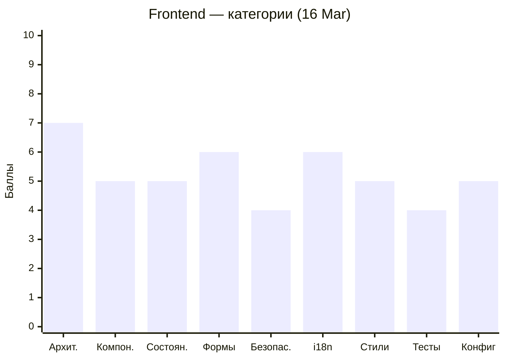
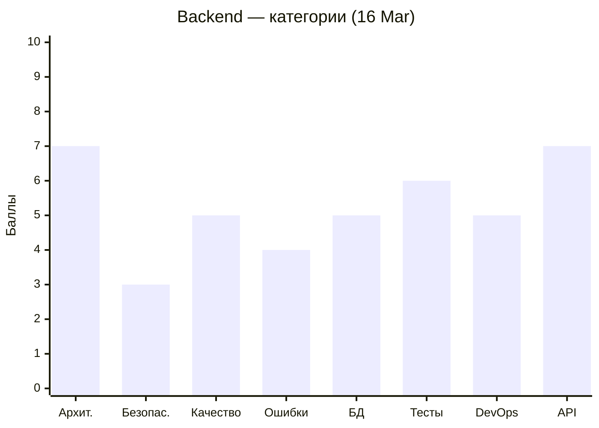

# Code Quality Status — MeowVault

Последнее ревью: **2026-03-16**

---

## 📝 Аналитическое резюме

### Текущее состояние

Проект живёт и развивается. Frontend — **5.5/10**, Backend — **6.0/10**. Базовая архитектура выстроена корректно: маршрутизация, guards, interceptor, session restore — всё на месте. Однако значительная часть мажорных и критических замечаний кочует из ревью в ревью без изменений, что тормозит рост оценок.

### Недавний прогресс (09 Mar → 16 Mar)

Frontend прибавил **+1.0 балл** — это хороший результат за неделю. Сделана наиболее архитектурно сложная часть: `AuthGuard`, `GuestGuard`, HTTP Interceptor с очередью pending-запросов, `provideAppInitializer` для восстановления сессии. Это показывает, что команда способна брать и закрывать сложные задачи. Backend остался на **6.0** — issues снизились, но незначительно. Критические проблемы безопасности (refresh token не хранится в БД, `verifyAsync` без `try/catch`) не тронуты с самого первого ревью.

### Общий прогресс

За два цикла ревью команда прошла путь от "работает, но небезопасно и архитектурно сыро" к "архитектурно правильно, но требует доработки в деталях". Ключевые Angular-паттерны (functional guards, interceptor, app initializer, signals) освоены и применены. Backend держится стабильно — структура модульная, Swagger подключён, JWT-стратегия в целом корректна.

### Впечатление

Команда движется в правильном направлении, и это видно. Когда задача берётся — она делается качественно. Но есть устойчивый паттерн: замечания по безопасности и "простые" задачи (OnPush везде, опечатки в именах классов `LaguageSwitcher`, `AppTosterService`) игнорируются несколько итераций подряд. Это не вопрос сложности — это вопрос приоритизации. Советую завести отдельный тикет на каждое CRITICAL/MAJOR замечание и не начинать новые фичи, пока они не закрыты.

Ещё один момент: тесты добавляются, но остаются поверхностными (smoke-уровень). Интерцептор — один из самых критических модулей — не покрыт ни одним значимым тестом. Тест, который проверяет только `toBeTruthy()`, не защищает от регрессий.

---

### Пожелания участникам

> ℹ️ *Индивидуальные наблюдения формируются на основе анализа git blame и PR-истории во время ревью. Секция обновляется при каждом ревью — см. REVIEW_PLAN.md, Шаг 4.2.*

#### Мария — [WhaleisaJoy](https://github.com/WhaleisaJoy)

**Что делала:** User Profile page, стили, Transloco-фиксы, dev-diary. Берёт задачи широкого профиля.

**Паттерны:** Работает аккуратно, но вклад в продуктовый код пока небольшой — много времени уходит на документацию. User Profile страница реализована, но остаётся заглушкой без контента.

**Совет:** Попробуй взять одно CRITICAL/MAJOR замечание из ревью на себя — например, SSR-safe рефакторинг `ThemeService` через `inject(DOCUMENT)`. Это конкретная, ограниченная задача с большим позитивным эффектом на оценку Security.

---

#### Алена — [Alena1409](https://github.com/Alena1409)

**Что делала:** Login page (#36) — главная фронтовая фича. HTTP Interceptors (#89). Merge game (в процессе).

**Паттерны:** Берётся за сложные архитектурные задачи и доводит их до конца — это сильная сторона. В коде Login обнаружена ошибка `403` вместо `401` при проверке credentials — скорее всего, неверная интерпретация API бэкенда без сверки с документацией. `getInputError` вызывается как метод в шаблоне вместо `computed()` — признак незнакомства с оптимизацией change detection.

**Совет:** Перед тем как отправлять код на ревью — свери статус-коды с бэкенд-командой или Swagger (`/docs`). И читай про `computed()` signals — это ключевой паттерн в Angular 20+ для вычисляемых значений в шаблоне.

---

#### Алексей — [AlexGorSer](https://github.com/AlexGorSer)

**Что делал:** Backend целиком (#21, #44, #70, #94, #105). CI/CD (#25, #33). GitHub OAuth. Merge game CRUD (в процессе).

**Паттерны:** Самый продуктивный участник по backend — выстроил всю архитектуру с нуля. Но критические security-проблемы остаются без изменений уже два ревью: refresh token не хранится в БД (logout можно обойти), `verifyAsync` без `try/catch` (500 вместо 401). Опечатка `gtUserProfile` — признак отсутствия code review самого себя перед пушем. `EMAIL_PATTERN` с неэкранированной точкой — классическая ошибка regex.

**Совет:** Security-задачи из Приоритета 1 — это не "можно сделать потом". Refresh token без инвалидации в БД — реальная уязвимость. Возьми одну: добавь поле `refreshToken String?` в `schema.prisma` + обнули при logout. Это два файла, 10 строк. И включи `noImplicitAny: true` в `tsconfig.json` — это поймает половину типовых ошибок автоматически.

---

#### Надежда — [kozochkina82](https://github.com/kozochkina82)

**Что делала:** 404 страница (#67), Main page с карточками (#98), diary records.

**Паттерны:** Main page реализована, но по-прежнему содержит только placeholder-текст через `t('*.mainWorks')` — фича не доведена до конца. Мало PRs с продуктовым кодом относительно других участников.

**Совет:** Main page — это твоя страница, и именно она первая видна пользователю. Убери заглушку `mainWorks` и добавь реальный контент — хотя бы карточки с будущими играми. Это сразу поднимет оценку "Компоненты" и "Стили" в ревью.

---

#### Оксана — [Oksi2510](https://github.com/Oksi2510)

**Что делала:** Registration page (#54), Eye Compass directive (#115), diary records.

**Паттерны:** Registration page реализована, но остаётся заглушкой — форма регистрации отсутствует, есть только `t('*.registrationWorks')`. Eye Compass directive — интересная и нетривиальная задача, это плюс.

**Совет:** Registration — это следующая по важности страница после Login. Форма уже частично описана в DTO на бэкенде (имя, email, пароль). Посмотри как устроена Login форма у Алены — там хорошая база: Reactive Forms, валидаторы, `takeUntilDestroyed`. Воспроизведи этот подход для Registration.

---

#### Павел — [pavelkuvsh1noff](https://github.com/pavelkuvsh1noff)

**Что делал:** Header, ThemeSwitcher, LanguageSwitcher (#24), Footer + ToasterService (#57), Logout + Avatar (#83), тесты (#109), Decrypto game (в процессе).

**Паттерны:** Самый активный фронтенд-разработчик по инфраструктурным компонентам. Именно в его коде сосредоточена основная масса нерешённых замечаний: `LaguageSwitcher` (опечатка в имени класса), `AppTosterService` (опечатка), `ThemeService` с прямым `localStorage` (SSR-краш), `ThemeSwitcher` без `[checked]` (визуальный баг при перезагрузке), мутабельное состояние в `LaguageSwitcher` вместо signals, `console.log` в header. Тесты добавлены, но остаются smoke-уровня.

**Совет:** У тебя много кода в проекте — это хорошо. Но пора "зачистить хвосты": опечатки в именах это не мелочь, это каждый день видит вся команда в автодополнении IDE. Переименуй `LaguageSwitcher` → `LanguageSwitcher` и `AppTosterService` → `AppToasterService` за один PR — это 15 минут работы. По сигналам: прочитай про Service State Pattern в Angular Signals — `private writable + public readonly`. Это изменит подход к стейту в компонентах.

---

## Frontend (Angular)

```mermaid
xychart-beta
    title "Frontend — тренд оценки"
    x-axis ["09 Mar", "16 Mar"]
    y-axis "Баллы" 0 --> 10
    line [4.5, 5.5]
```



| Severity | 09 Mar | 16 Mar | Δ |
|----------|--------|--------|---|
| 🔴 Critical | 6 | 2 | ↓4 |
| 🟠 Major | 8 | 7 | ↓1 |
| 🟡 Minor | 8 | 7 | ↓1 |

---

## Backend (NestJS)

```mermaid
xychart-beta
    title "Backend — тренд оценки"
    x-axis ["09 Mar", "16 Mar"]
    y-axis "Баллы" 0 --> 10
    line [6.0, 6.0]
```



| Severity | 09 Mar | 16 Mar | Δ |
|----------|--------|--------|---|
| 🔴 Critical | 4 | 3 | ↓1 |
| 🟠 Major | 9 | 8 | ↓1 |
| 🟡 Minor | 6 | 5 | ↓1 |
