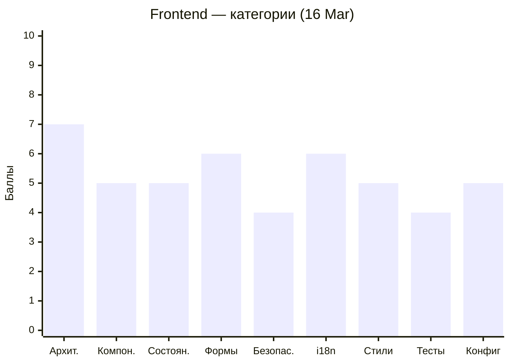
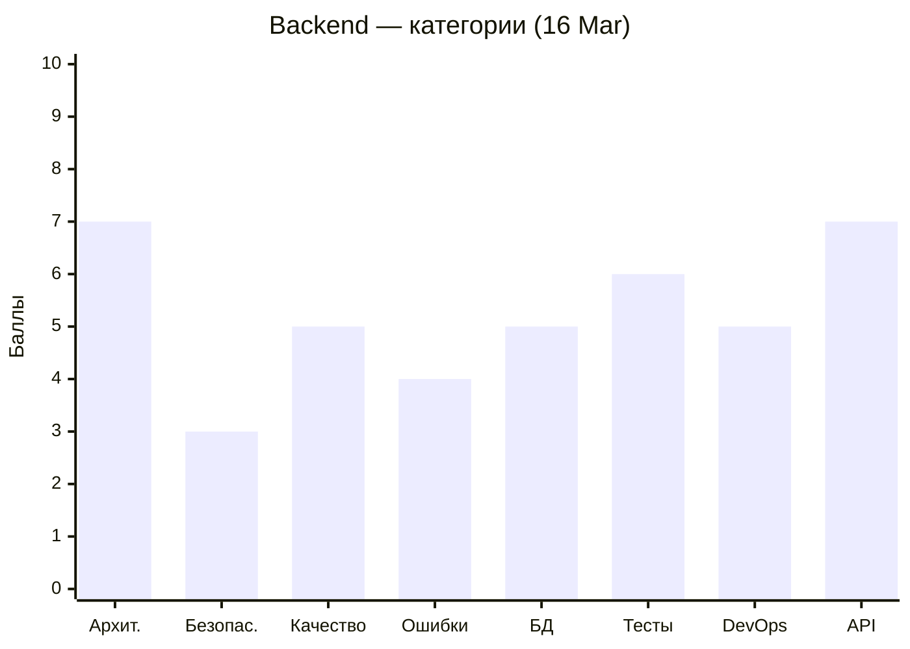

# Code Quality Status — MeowVault

Последнее ревью: **2026-03-16**

---

## Frontend (Angular)

```mermaid
xychart-beta
    title "Frontend — тренд оценки"
    x-axis ["09 Mar", "16 Mar"]
    y-axis "Баллы" 0 --> 10
    line [4.5, 5.5]
```



| Severity | 09 Mar | 16 Mar | Δ |
|----------|--------|--------|---|
| 🔴 Critical | 6 | 2 | ↓4 |
| 🟠 Major | 8 | 7 | ↓1 |
| 🟡 Minor | 8 | 7 | ↓1 |

---

## Backend (NestJS)

```mermaid
xychart-beta
    title "Backend — тренд оценки"
    x-axis ["09 Mar", "16 Mar"]
    y-axis "Баллы" 0 --> 10
    line [6.0, 6.0]
```



| Severity | 09 Mar | 16 Mar | Δ |
|----------|--------|--------|---|
| 🔴 Critical | 4 | 3 | ↓1 |
| 🟠 Major | 9 | 8 | ↓1 |
| 🟡 Minor | 6 | 5 | ↓1 |
