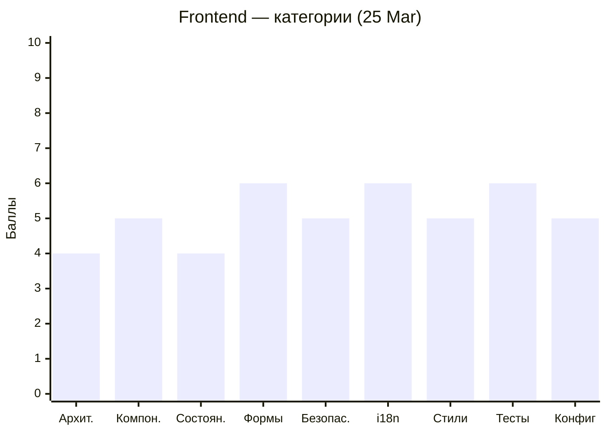
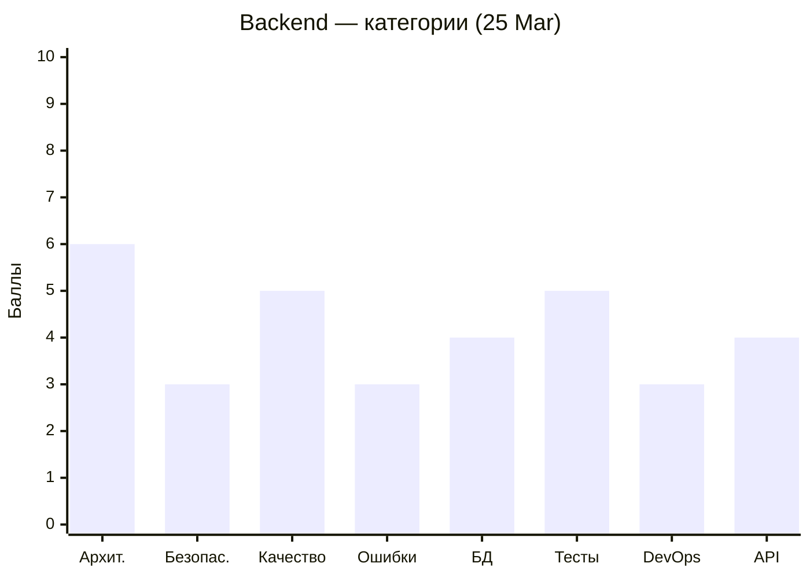

# Code Quality Status — MeowVault

Последнее ревью: **2026-03-25**

---

## 📝 Аналитическое резюме

### Текущее состояние

Проект продолжает расширяться, качество стагнирует. Frontend — **5.0/10** (без изменений), Backend — **5.0/10** (было 5.5). За цикл 19 Mar → 25 Mar сделано несколько важных исправлений: убран `@Public()` с `KeyStorageController`, исправлен `ForbiddenException`→`UnauthorizedException`, добавлена навигация после регистрации, `ThemeSwitcher` корректно отображает тему. Появился `MergeGameModule` с AI-интеграцией (Groq), `AccountForm`/`PasswordForm` в настройках профиля, `PopupService`, компонент `Decrypto`. Однако каждая новая фича приносит новые CRITICAL/MAJOR: AI-эндпоинт без Rate Limiting, `RolesGuard` с `ImATeapotException`, `AiService` поглощает все ошибки. Frontend: 3 CRITICAL / 18 MAJOR / 12 MINOR (было 3/14/11). Backend: 5 CRITICAL / 12 MAJOR / 9 MINOR (было 5/13/11).

### Недавний прогресс (19 Mar → 25 Mar)

**Frontend** держит 5.0/10. RESOLVED за цикл: навигация после регистрации, `[checked]` в `ThemeSwitcher`, опечатка в spec-файле, лишний `title` signal в `App` — четыре мелких исправления. Появился `Decrypto`-компонент (с `console.log` в production и вызовами методов дочернего `Timer` через `viewChild`), `AccountForm` (использует `effect()` для мутации формы — антипаттерн), `KeyStorageService` (показывает тостер прямо в HTTP-сервисе — нарушение SRP). Счётчик MAJOR вырос с 14 до 18 — новый код приносит новые замечания быстрее, чем закрываются старые.

**Backend** потерял **-0.5 балла** (5.5 → 5.0). RESOLVED за цикл: пять исправлений — убран `@Public()` с `KeyStorageController`, `UnauthorizedException` при логине, `provider: true` в `refresh()`, опечатка в имени файла DTO, корректный upsert по `providerId`. Это реальный прогресс по безопасности. Но `MergeGameModule` добавил новые CRITICAL: AI-эндпоинт открыт для flood-атак (`POST /ai/check-answer` без throttler — прямые расходы на Groq API), `AI_KEY`/`AI_URL`/`AI_MODEL` отсутствуют в `.env.example` (приложение упадёт при старте). `RolesGuard` — новый guard с двумя багами сразу: `ImATeapotException` вместо `UnauthorizedException` и сравнение `user.role === roles[]` через `===` (всегда false для массива).

### Общий прогресс

За четыре цикла ревью (09 Mar → 16 Mar → 19 Mar → 25 Mar) динамика следующая:
- **Frontend:** 4.5 → 5.5 → 5.0 → 5.0. Рост на втором цикле (guards, interceptor, session restore) был реальным. С тех пор — плато. Количество замечаний: 22 → 16 → 28 → 33. Долг растёт.
- **Backend:** 6.0 → 6.0 → 5.5 → 5.0. Устойчивое снижение с третьего цикла. Количество замечаний: 18 → 16 → 29 → 26. Небольшое снижение общего числа, но CRITICAL не уменьшается (5 подряд два цикла).
- **Общий тренд:** четыре CRITICAL из первого ревью backend (09 Mar) до сих пор открыты — refresh token в БД, `verifyAsync` try/catch, `.env.example` с паролями, мёртвая ветка в `refresh()`. Frontend: `ThemeService` с прямым `localStorage` открыт с 09 Mar, `LaguageSwitcher`/`AppTosterService` — с 09 Mar, `403`→`401` в Login — с 09 Mar.

### Впечатление

Главный системный паттерн команды — **feature-first без возврата к долгу**. Новые модули создаются активно и порой неплохо написаны (`AccountForm` с signals, `effect()`, `OnPush` — технически грамотнее предыдущего кода). Но ни один CRITICAL из первого ревью не закрыт за 16 дней. Это не проблема навыков — это проблема приоритетов.

Второй паттерн — **новый код копирует антипаттерны существующего**. `DecryptoGameService` с шестью публичными мутабельными массивами повторяет то же, что есть в `LaguageSwitcher`. `AiService.catch {}` без параметра — та же проблема, что и в `refresh()` без try/catch. Команда не читает ревью перед написанием нового кода.

Третий паттерн — **технический долг концентрируется у одних, а не закрывается**: у Павла шесть замечаний открыты четыре цикла подряд. У Алёны замечания по Login и Interceptor открыты с 09 Mar. У Алексея четыре CRITICAL по аутентификации открыты с 09 Mar.

Положительный сигнал: в последнем цикле backend закрыл пять замечаний сразу — значит, команда способна закрывать долг, когда фокусируется на этом. Frontend закрыл четыре. Нужно сделать это системой, а не исключением.

Рекомендация: ввести правило **"каждый PR должен закрывать минимум одно открытое замечание из ревью"**. Сейчас открыто 8 CRITICAL (3 frontend + 5 backend) — каждое конкретная задача на 15-60 минут.

---

### Пожелания участникам

> ℹ️ *Индивидуальные наблюдения формируются на основе анализа git blame и PR-истории во время ревью. Секция обновляется при каждом ревью — см. REVIEW_PLAN.md, Шаг 4.2.*

#### Мария — [WhaleisaJoy](https://github.com/WhaleisaJoy)

**Что делала в последнем цикле:** PR #155 — `AccountForm` и `PasswordForm` в настройках профиля: реактивные формы с сигналами, `OnPush`, `effect()` для синхронизации. PR #168 (открыт) — индикатор загрузки. Это самая технически зрелая работа за весь период — signals, `effect()`, `OnPush` применены осознанно.

**Паттерны ошибок:** `effect()` используется для мутации реактивной формы через `patchValue` — Angular-документация явно указывает, что `effect()` не предназначен для этого. `ProfileSidebar` — избыточный `initialValue` при наличии `startWith`. Данные профиля (`"Racing"`, `"Puzzle"`, `127`, `45,820`) захардкожены три цикла подряд. Опечатка `mismathPassword` в JSON-переводах — тоже три цикла.

**Совет:** Замени `effect()` в `AccountForm` на `ngOnChanges` или `toSignal` — это главное замечание нового цикла. Исправь `mismathPassword` → `mismatchPassword` в `public/i18n/user-profile/ru.json` и `en.json` (два файла, одна строка каждый) — это замечание открыто уже давно. Захардкоженные числа в профиле замени хотя бы на `userStore.user()?.username` — покажи что данные подключены к API.

---

#### Алена — [Alena1409](https://github.com/Alena1409)

**Что делала в последнем цикле:** PR #136 — `merge-game ai method check-answer` — добавила `AiService` с интеграцией Groq API, `CheckAnswerDto`, `AiController`. PR #106 (открыт) — продолжение работы над Merge Game. Из предыдущих замечаний ничего не тронуто.

**Паттерны ошибок:** `AiService.checkAnswer` использует `catch {}` без параметра — все ошибки (SyntaxError, сетевые, валидационные, конфигурационные) маскируются под `BadRequestException(400)`. `CheckAnswerDto.personality` типизирован как `string` вместо `PersonalityType` — при невалидном значении `systemPrompt` станет `undefined`. AI-эндпоинт без Rate Limiting — прямые расходы на Groq при flood. Login: `403`→`401` и `getInputError` как метод в шаблоне открыты с 09 Mar.

**Совет:** В `AiService.catch` добавь параметр и различи ошибки: `if (error instanceof BadRequestException) throw error; if (error instanceof SyntaxError) throw new InternalServerErrorException(...)` — это уберёт два новых MAJOR. Добавь `ThrottlerModule` + `@Throttle` на `/ai/check-answer` — это CRITICAL (деньги). И наконец закрой `403`→`401` в Login — одна строка, открыта 16 дней.

---

#### Алексей — [AlexGorSer](https://github.com/AlexGorSer)

**Что делал в последнем цикле:** PR #131 — `MergeGameModule` с полным CRUD: `DataController`, `WordController`, `QuestionController`, `RolesGuard`, AI-интеграция. PR #94 (предыдущий цикл) — GitHub OAuth с upsert. Пять замечаний закрыто за цикл — лучший показатель по команде.

**Паттерны ошибок:** `RolesGuard` написан с двумя багами одновременно: `ImATeapotException` (HTTP 418 — шуточный статус, ломает клиентскую обработку) и `user.role === roles` при `roles: string[]` (всегда `false` для массива). `AI_KEY`/`AI_URL`/`AI_MODEL` забыты в `.env.example` — приложение упадёт при старте у любого нового разработчика. Четыре CRITICAL из первого ревью (refresh token в БД, `verifyAsync` try/catch, `.env.example` пароль, мёртвая ветка) открыты 16 дней.

**Совет:** `.env.example` с AI-ключами — добавь три строки прямо сейчас, это CRITICAL для онбординга. `RolesGuard`: замени `ImATeapotException` → `UnauthorizedException` и `===` → `Array.isArray(roles) ? roles.includes(user.role) : user.role === roles` — два фикса в одном файле. Затем `verifyAsync` try/catch — 5 строк, CRITICAL по безопасности, открыт с 09 Mar.

---

#### Надежда — [kozochkina82](https://github.com/kozochkina82)

**Что делала в последнем цикле:** PR #166 — дневник разработки за период 15-23 Mar. Из кодовых изменений — ничего. Предыдущий кодовый PR #98 (main page) — из предыдущего цикла. Замечания не тронуты.

**Паттерны ошибок:** 6 копипастных HTML-блоков с `"Replace me"` вместо `@for` — открыто три цикла. Кнопка "Начать" без `routerLink` и `(click)` — мёртвый элемент три цикла. Внешний CDN URL для иконки (`flaticon.com`) — нарушение CSP. `Header` без проверки `isLoggedIn()` показывает `user_bar` всем пользователям.

**Совет:** В этом цикле один PR с кодом изменит картину. Замени шесть копипастных блоков на массив + `@for` — покажи владение Angular Control Flow. Добавь `routerLink="/login"` или `routerLink="/registration"` на кнопку "Начать". Это два замечания MAJOR, один файл (`main.html`), 20 минут работы. Скачай иконку из CDN локально в `public/assets/icons/` — одна строка в HTML.

---

#### Оксана — [Oksi2510](https://github.com/Oksi2510)

**Что делала в последнем цикле:** PR #174 — страница регистрации (повторный мерж, финальная версия). PR #151 — `fix: update app.config for transloco`. PR #150 — `refactor: update eye directive`. Из предыдущих замечаний `RegistrationService` и `throw new Error` не тронуты.

**Паттерны ошибок:** CRITICAL сохраняется: `RegistrationService` изолирует `accessToken` от `AuthService` — после регистрации `isLoggedIn() === false`. `throw new Error` в `submit()` без внешнего catch — unhandled rejection. `EyeCompassDirective` ищет `[data-pupil]`, шаблон использует `#pupil` — директива не активируется никогда, несмотря на refactor в PR #150. `autocomplete="current-password"` на полях регистрации — spec нарушен.

**Совет:** Удали `RegistrationService` — три строки: замени `inject(RegistrationService)` на `inject(AuthService)`, поменяй вызов. Это CRITICAL, который блокирует корректную работу авторизации. В `EyeCompassDirective` исправь `[data-pupil]` на `#pupil` или наоборот — сейчас директива написана, но не работает. `autocomplete="new-password"` — одна строка.

---

#### Павел — [pavelkuvsh1noff](https://github.com/pavelkuvsh1noff)

**Что делал в последнем цикле:** PR #146 — `Decrypto`-компонент с таймером, popup, логикой игры. Технически объёмная работа — game service, timer, popup. Из предыдущих замечаний ни одного не тронуто.

**Паттерны ошибок:** Новый код воспроизводит старые проблемы. `DecryptoGameService` — шесть публичных мутабельных массивов вместо signals (те же грабли, что в `LaguageSwitcher`). `console.log(this.gameStarted())` в `newGame()` — production-код с отладкой. `viewChild(Timer)` с прямыми вызовами методов дочернего компонента — нарушение однонаправленного потока данных. Дублирующий HTTP-запрос в `ngOnInit`. И четыре цикла подряд: `LaguageSwitcher` (опечатка), `AppTosterService` (опечатка), `ThemeService` с `localStorage` при конструировании (CRITICAL SSR), `ThemeSwitcher` без `[checked]` (уже исправлен другим участником).

**Совет:** Четыре цикла — ноль исправлений по замечаниям — это сигнал, что замечания не читаются. Начни с двух минутных фиксов в новом коде: `console.log(this.gameStarted())` — удали строку. `this.gameService.gameCardsFromServer = data` — замени на метод-сеттер `setGameCardsFromServer(data)` в сервисе. Затем `ThemeService`: замени `localStorage.getItem(...)` на `inject(DOCUMENT).defaultView?.localStorage.getItem(...)` — это CRITICAL, который висит с 09 Mar.

---

## Frontend (Angular)

```mermaid
xychart-beta
    title "Frontend — тренд оценки"
    x-axis ["09 Mar", "16 Mar", "19 Mar", "25 Mar"]
    y-axis "Баллы" 0 --> 10
    line [4.5, 5.5, 5.0, 5.0]
```



| Severity | 09 Mar | 16 Mar | 19 Mar | 25 Mar | Δ |
|----------|--------|--------|--------|--------|---|
| 🔴 Critical | 6 | 2 | 3 | 3 | = |
| 🟠 Major | 8 | 7 | 14 | 18 | ↑4 |
| 🟡 Minor | 8 | 7 | 11 | 12 | ↑1 |

---

## Backend (NestJS)

```mermaid
xychart-beta
    title "Backend — тренд оценки"
    x-axis ["09 Mar", "16 Mar", "19 Mar", "25 Mar"]
    y-axis "Баллы" 0 --> 10
    line [6.0, 6.0, 5.5, 5.0]
```



| Severity | 09 Mar | 16 Mar | 19 Mar | 25 Mar | Δ |
|----------|--------|--------|--------|--------|---|
| 🔴 Critical | 4 | 3 | 5 | 5 | = |
| 🟠 Major | 9 | 8 | 13 | 12 | ↓1 |
| 🟡 Minor | 6 | 5 | 11 | 9 | ↓2 |
