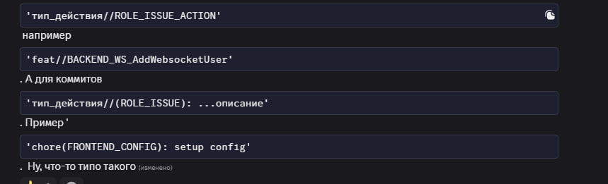
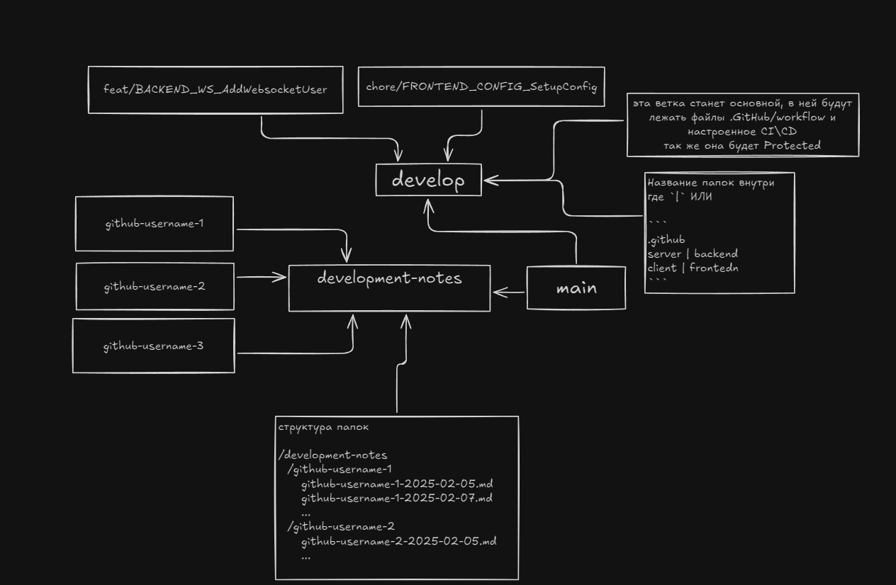
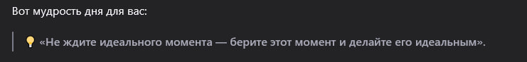

Дата: 2026-02-25

Попробую такой формат записи дневника совмещая его с практикой слепой печати. Дневник не только должен отражать мысли, но еще, может быть полезен и в печати.

Сегодня (или точнее вчера вечером) произошел внеплановый созвон где мы хотели раздать доступы к репозиторию дабы начать вести свои дневники, и в последствии созвон стал внеплановым митом где мы обсудили о том что мы будем делать на задании.

Предварительно мы решили делать задание Codenames весьма занятную игру, но после обсуждения сделали опрос на дисе для выбора окончательного варианта.

Выбор идет между Codenames - "рисковый вариант" и Каталог мини-обучающих игр как "безопасный вариант".

Почему дали такую кларификацию?
Codenames выглядит интересно и комплексно и затрагивает тот аспект который мы недавно изучали на Fun-Chat. Но так же его разработка может очень сложна так как есть несколько проблем из которой есть одно важное: "бутылочное горлышко" из-за которого вся разработка может полностью встать. Так как она зависит полностью от бэка и нужно его делать намного опережая саму разработку фронта.

Так почему "рисковый вариант"? Так как много вещей может пойти не так с тем кто разрабатывает бэк (метеоритом прибьет, мало-ли). То, по сути, разработка встанет полностью так как у остальных членов команды есть свои компоненты которыми они должны заниматься.

Так же кто-то кроме бэка может выпасть из разработки и это тоже может остановить разработку, при том что компоненты сильно могут повязаны друг на друге. И при таком сценарии одному из нас продеться взять на себя его нагрузку. Это еще при хорошем варианте если будет время. И выпасть может не один и не два. Такой сценарий стоит учесть и взвесить риски.

От того и появился "безопасный вариант".
Он включает два этапа:

Создание переиспользуемых компонентов простых и общих, для создание общего шаблона проекта где в последующем будем добавлять новые фичи.

Сам второй этап это сами фичи. Где каждый из членов команды делает свою мини игру и добавляет в общий каталог, где пользователь который будет использовать нашу апку будет выбирать в списке одну из предложенных игр.

Разработка такого приложения не будет стопорить никого из разработчиков и каждый будет разрабатывать свою игру\фичу для приложения.

Даже если выйдет так что один из членов команды отвалиться: то это не должно отразиться на самом приложении.

Если отвалиться бэкер то просто данные для игры будут хранить на фронте.

Так же, если будет очень быстро сделана программа "минимум". То ничего не мешает на оставшееся время сделать одну большую (хоть не очень комплексную) игру\фичу тем кто захочет и будет свободен.

Так-как у нас еще есть время на подумать до 22.02 пока еще не начали разработку, был сделан опрос и может на следующем мите будут предложены иные варианты.

Пока расклад по выбору на 20.02 такой.

Следующий темой немного обсудили про форматы style-guide для проекта и так же инструкции на wiki проекта если что-то пойдет не так или что делать если не пушиться ветка или если нужно обновить какой-то общий компонент.

Так же затронули template для .github где PR и для ISSUE. Где мы редактировали предложенные мной ранее заготовки.

[PR](./assets/md/2026-02-20/pr.md)
[ISSUE](./assets/md/2026-02-20/issue.md)

Это первые варианты которые были предложены и которые мы доработали. Когда их окончательно примем, то опишу в другом дневнике.

Так же обсудили систему названия веток и коммитов



Взяли за основу систему которая использовалась в RSS-PZ таске.
В нашем обсуждении присоединился ментор который рассказал что ссылки на issue можно встраивать в коммит и при пуше в репо, ссылка будет вести прямо на issue:

;

Думаю, возьмем такой вариант для коммитов где:

```
feat(LINK_TO_ISSUE): описание коммита
```

Дня так три назад, я сделал блок схему для примерного понимания как будем работать с ветками. Не знаю, будем ли мы прикреплять его к нашему style-guide, потому линкану его тут.



Еще прикреплю CI action который вывел по время жестких разборок со своим тестовым репозиторием

[CI Action](./assets/yml/ci.yml)

Еще планирую добавить туда ранеры для проверки eslint, prettier и билда приложения.

На следующем мите нужно настроить CI\CD, сделать style-guide, инструкции для работы с ветками. А так же засетапить начальную конфигурацию проекта.

У нас, как можно видеть на скрине выше структура репо будет такой

```
/backend
  ...тут будет nest.js бэк
/frontend
  ...тут будет Angular front

README.md
```

Такое своеобразное псевдо-моно репа.
Так жу думаю, мы рядом с README положим нашу style-guide md фал. Где пр необходимости можно напомнить себе как мы называем ветки и коммиты.

Далее мы окончательно определим роли и начнем заполнять наши первые issue и начнем разработку.

Это все мысли которые я вспомнил и записал в первый дневник которые пришли ко мне в 3 часа ночи.
Ну, еще и потренировал слепую печать.

И в качестве завершения этого дня, решил дать запрос для нейросетки

```
напиши умную мысль дня
```

И короткий ответ был такой: 



Ну что-ж, делаю постоянной рубрикой своего дневника?

P.S не читайте плз.
