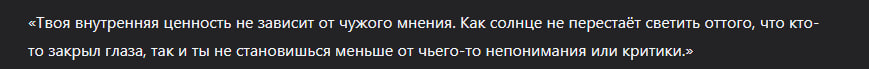

Дата: 2026-02-23

Три часа ночи, самое время писать дневник, заливаем литр, колы включаем [pinKing](https://www.youtube.com/watch?v=dQw4w9WgXcQ&list=RDdQw4w9WgXcQ&start_radio=1) и продолжим тренировать слепую печать.

22.02 прошел мит где мы обсудили, распределили и инициализировали проект на Angular и добавили первые правила для Eslint and Prettier, сегодня так получилось что не все успели, так что продолжим сегодня днем.

Взял на себя роль бэкендера так как у меня есть опыт разработки и я уже делал нечто подобное.

Из стэка я буду использовать Nest.js так как он максимально похож на Angular который взяли на фронт, а так же я с ним знаком и не надо будет тратить много времени на обучение.

По плану первой реализация буду делать API для регистрации и логина. Довольно таки простая задача  если использовать готовые решение по типу Firebase или Supabase authentication. 

Я решил отказаться от готового решения и реализовать все логику самостоятельно используя только Supabase PostgreSQL в качестве облачной таблицы.

Почему я сделал такой выбор? Первое PostgreSQL является одной из самых распространенный БД для разработки а так же при необходимости я могу поменять на другую БД только использовав другие данные для подключение к ним. 

По началу была идея поднять свою БД использую докер и захостить его. Но это было бы несколько рискованным, если с докером что-то случиться без дополнительных бэкапов то все данные потеряться и невозможно будет их восстановить. Поэтому я решил использовать облачное решение Supabase. Может у AWS есть такая же возможность использовать PostgreSQL, но я не искал, может посмотрю позже.

Для работы с ДБ буду использовать Prisma ORM, я некогда пробовал и использовал TypeORM но решил использовать призму чтоб познакомиться с новый для себя ORM.

Для документации буду использовать Swagger это опростит документацию и покажет для моих коллег какие есть API и примеры их использования.

Может под конец разработки запихаю все в докер и буду его хостить, посмотрим.

Для реализации регистрации и логина, буду использовать JWT токены, засаливать и хэшировать пароли и отправлять в куках на фронт, а так же валидировать те токена которые пришлют мне дабы можно было пускать на другие роуты и получать доступ к другим API.

Пока предварительный план по бэку такой, далее по плану буду смотреть какие нужно будет реализовать таблицы для тех игр которые разрабатывает моя тима.

Если у меня будет достаточно много свободного времени, я попробую реализовать свою игру и добавить ее в общий каталог, у меня есть некоторые наброски которые сгенерировал мой сонный биокомпуктер с 1Гб оперативки на борту и литром колы в качестве топлива.

Я опишу более подробнее когда продумаю получше и напишу в некст дневниках.

И, это вроде все мысли которые сегодня я записал и смог вспомнить.

И так, на завершения, мудрая мысль дня от нейросетки

