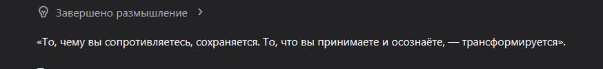
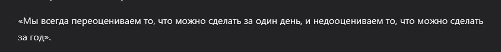

Дата: 2026-03-07

Очередная ночь, 4 часа, очередной дневник, шош, погнали.

На этой неделе закончил писать первый компонент\модуль бэка. Сервер авторизации.

У меня была интересная мысль попробовать сделать весь проект с помощью микросервесной архитектуры использую gRPC от гугла, который управляет запросами и распределяет их по запрошенными сервисами.

Такое было бы интересно попробовать но это бы добавило слишком много проблем для дальнейшей разработки. Это весьма занимательная технология, она бы позволила разбить монолитный бэк на каждый отдельный сервис и использовать его не зависимо от остальных компонентов, даже если один из сервисов отвалиться, то весь бэк кроме упавшего сервиса будет работать, очень хотелось бы попробовать но тут есть парочка "но".

Мне бы пришлось паковать каждый отдельный сервис с докер контейнер и отправлять его на Render где он будет ожидать своего часа славы, но Render позволяет только один проект на фри версии, конечно, думаю можно было бы наплодить очень много аков, но боюсь я могу получить пожизненный бан на данной платформе.

Можно было бы конечно запихать все в докер, в котором будут подниматься еще докер контейнеры, но в таком случае теряется полностью смысл микросервисов. (Жду спонсора).

Пока писал следующий текст, задумался, если мы можем поднять очень много контейнеров в кубере и потом распределять запросы с помощью nginx с его алгоритмом круглого Робина, то как как в таком случае будет действовать gRPC? Поднимать много кластеров в которых будут куча своих кластеров с сервисами? Нужно ли поднимать несколько гейтвеев для этого? Если один контейнер в кластере кубера помрет, он  его просто перезапустит, будет недоступен один из серверов. Крч, надо будет подробнее изучить как и когда стоит использовать gRPC.

Потому я решил остановиться на монолитном решении.

Модуль авторизации\логина\регистрации с фронта приходят данные пользователя я шифрую пароль с помощью bcrypt сохраняю в базу данных и с помощью JWT возвращаю два токена accessToken и refreshToken.

Первый токен я отправляю в качестве json body на фронт а второй я отправляю в куках. Я запретил фронту видеть какие куки сейчас находятся у них в хранилище, хоть возможно это для разработки и плохо, можно было и на проде отключить, но, пока жалоб не поступало, посему оставлю пока так.

Все настройки необходимые для токенов, шифрования, сервера базы данных и так же для доступа к CORS я вынес в .env файле и могу теперь при желании на Render менять доступы и так же могу поменять сервер базы данных без каких либо проблем. Миграции для Prisma так же настроены. 

CORS у меня используется двумя способами: Я могу запихать полностью ссылку URL а так же могу использовать регулярка. Прямую ссылку я вставил для разработки localhost на порту 4200, а вторую с помощью регуляри так как у нас есть предепрой и статичная ссылка и было необходимо дать доступ обоим ссылкам и бесконечного числу предеплоев.

Меня так же попросили улучшить\дополнить Swagger документацию так как не совсем очевидно как ее использовать, я в начале хотел достаточно подробно ее описать, но в таком случае контроллер бы раздула как внука после похода к бабушке. 

Попробую написать чуть подробнее или напишу отдельную инструкцию как его использовать.

На этих выходных в планах создать модуль для получения профиля пользователя а так же изменения\удаления его учетных данных. 

Полее подробнее я напишу в некст дневнике.

Связанные issue и pr с текущим компонентом:

[Issue#26](https://github.com/ngKittyDebug/RS-Tandem-ngKittyDebug/issues/26)

[PR#44](https://github.com/ngKittyDebug/RS-Tandem-ngKittyDebug/pull/44)

Так же помогаю команде решать небольшие организационные проблемы и недочеты в коде. 

Хотелось-бы пообщаться с матерым бэкером и расспросит как лучше организовывать роуты и защищать данные от несанкционированного доступа. Так же интересно узнать, когда стоит отправлять токен на валидацию с фронта, отправлять на каждый переход пользователя по страницам, или только тогда, когда пользователь стучится на бэк. Нужен ли для этого отдельный эндпоинт, или хвати  глобального гварда?

Это пока что все мысли которые я хотел записать или те о которых я вспомнил. 4 часа на часах, пора спать, завтра будет великий день, столько еще котиков не поглажено, еще столько персонажей а гаче играх не выбито, все желают внимания. 

Я на пару дневников забыл про умные мысли дня\ночи. Надо наверстать упущенное.

