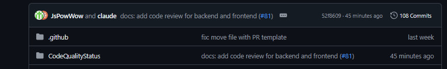
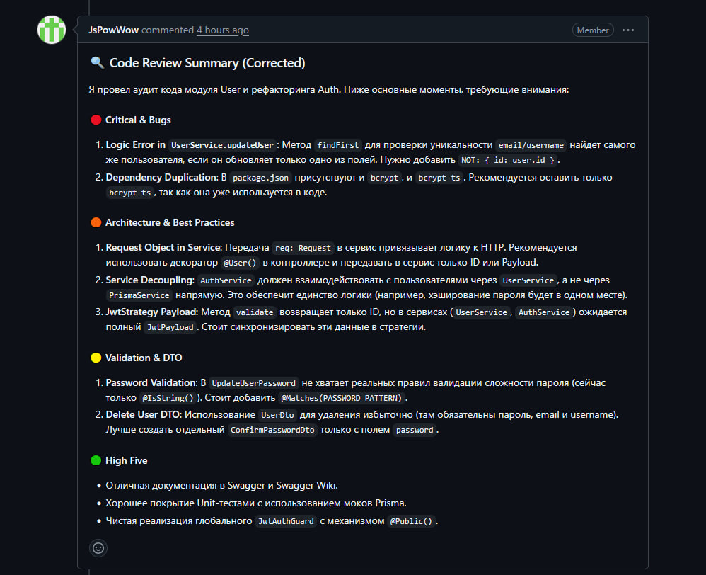
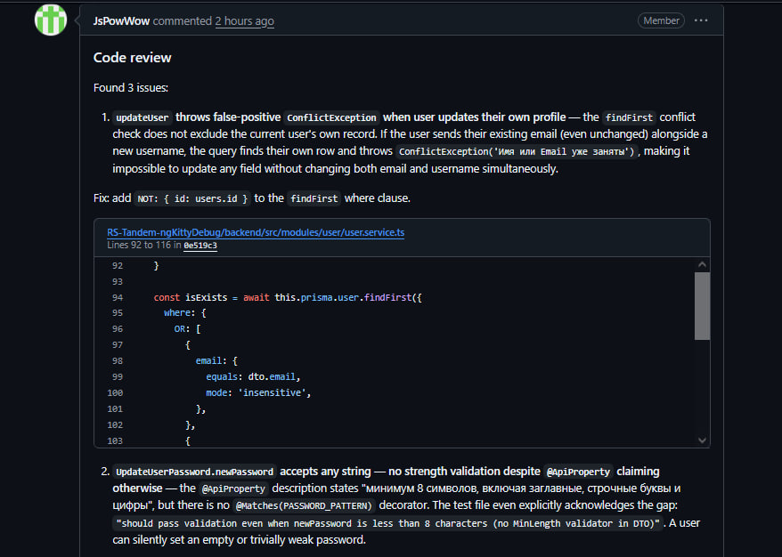
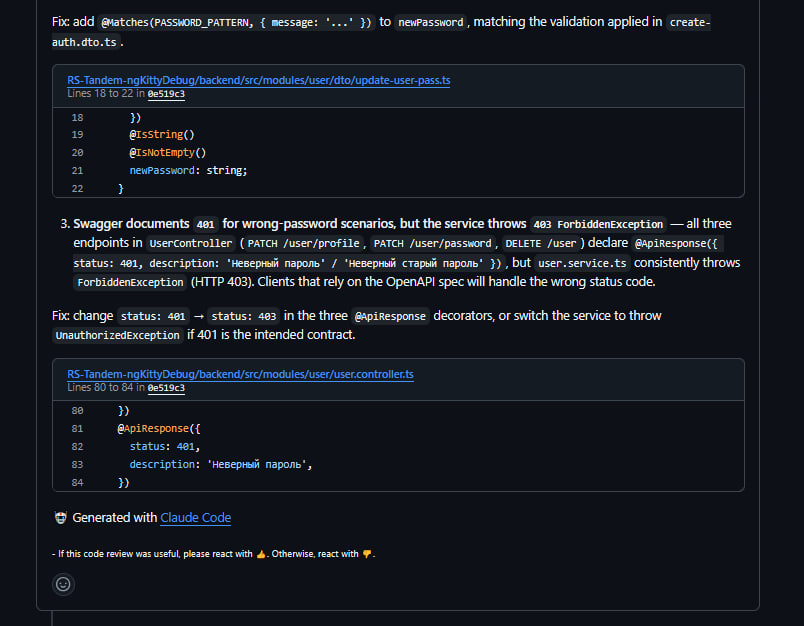
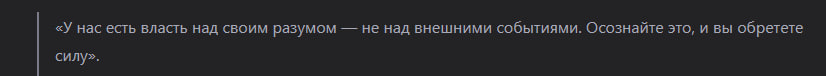

Дата: 2026-03-09

На выходных написал новый компонент который отвечает за получение\изменение\удаление учетных данных пользователя, так же чекпойит на этой неделе нужно предоставить ссылку на записсаное видео, пока я пишу дневник видео монтируется и в конце я предоставлю ссылку.

Для ветки с записями дневника, так получилось что случайно залили весь наш проект, мы откатили эти изменения и я написал простой CI со скриптом для ветки с дневниками который будет проверять разрешенные папки в этой ветке, если есть лишние папки то CI  не даст просто так замержить пр в ветку с дневниками. CI срабатывает только для ветки с дневниками.

На этой неделе хочу попробовать сделать авторизацию через Github.

Как я понял для валидации уже есть готовые библиотека от passport. Мне достаточно написать роуты для редеректа а так же для сохранения данных пользователя, и мне еще нужно будет в моделе сделать пару новых полей, с указанием ид пользователя гитхаба а так же что использовал пользователь для регистрации, мое решение или гитхаб.

Пока не совсем до конца понимаю этот механизм, так что мне стоит изучить его более тщательно и узнать какие я могу использовать данные от пользователя. 
Пока что мне нужно для регистрации пользователя это никнейм и его имаил.

Так же планируем добавить аватарки пользователя, я хотел для этого использовать хранилище в supabase, но для фрии варианта там всего доступно 50mb, потому нашли другое облачное хранилище и с ним пока разбирается наш тим-лид. Я пока создам новую пустую ячейку для хранения ссылок на аватарку.

Так же хочу еще подключить авторизацию через гугл, но там нельзя настроить гибкие редеректы для ссылок, так как у нас есть деплои и предеплои и не получиться гибко настроить, с гитом как я прочитал таких проблем нет.

Так же, думаю сделать гварда для проверки ролей пользователя для админ панели. 

Если на этой неделе у кого то будет готова игра, буду писать компонент бэка для хранения и получения данных для этих игр, там же думаю и пригодиться админ гвард, если нужны будут роуты для изменения записей в табличке.

А так же сегодня для нашего репозитория, ментор-Сасарик-легенда, подключил ИИ  Claude Code для ревью нашего кода. Ии-шка будет чекать наши ПР и писать комментарии с проверкой кода, а так же писать советы по исправлению issue которые он найдет.

А так же ИИ делает отдельную ветку с полным чеком нашего проекта используя лучшее практики и пишет оценку для каждого из проекта для бэка и фронта. Мы можем чекнуть все ревью от ИИ в любой момент и если получиться, поправить все замечание которые он написал.

Если получиться, я попробую исправить все те недочеты которые написала ИИ-шка.

На данный момент, ИИ  написала ревью для моего ПР, сегодня\завтра попробую поправить что получиться.

Это будет весьма интересный эксперимент менторинга со стороны ИИ.
Учитывая что с бэком более\менее знаком только я, то ИИ вполне может указать на слабые места моего проекта.

Пока, это вроде все что я надумал.

И под конец умная мысль дня.

А вот и ссылка на ролик для задания [Link](https://youtu.be/0l7HuFdQCAE)