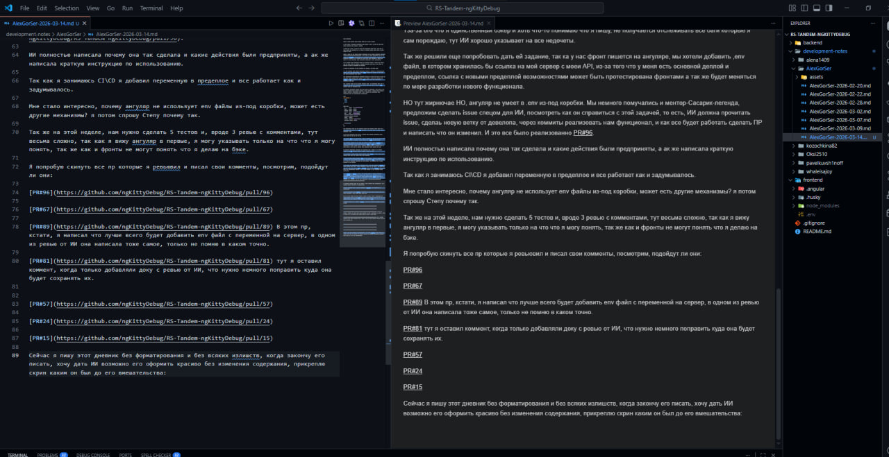
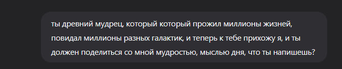

# Дневник разработки

**Дата:** 2026-03-14

---

## Вступление

Почему я всегда начинаю писать дневник ночью, что за дела то такие?

---

## Реализация авторизации через GitHub

На этой неделе я реализовал авторизацию через Github, я даже и не знал что можно было делать редиректы через запросы к серверу.

Я изучил доку с гита и с гугла как можно было реализовать OAuth, дока с гита была не очень удобная для понимания или я ее просто не правильно понял, потому делал по другим статьям из сети.

Благо, я увидел что для каждого способа регистрации уже еть готовые библиотеки [passport](https://www.passportjs.org/packages/) на все случаи и сервисы регистрации, они уже под капотом все валидируют и расшифровывают для дальнеишего использование в проекте. Я когда использовал passport для JWT токенов, не сразу придал этому значение, но теперь буду знать что я могу реализовать любые регистрации авторизации с этими библиотеками.

### Декораторы Nest.js

ТАк же научился делать декораторы Nest.js для извлечения данных по ключу, если передаю ключ мне отдает только то значение к которому относиться этот ключ, а если ничего не передаст то отдаст мне полностью весь payload.

Я сделал эти декораторы для моей реализации JWT токенов и для Github auth.

### Swagger

Я не смог настроить верно Swagger документацию которая бы позволила это протестировать, потому я ней я пока закрыл доступы к этим роутам, попробую еще почитать об этом когда буду делать регистрацию через Google.

### Как работает Github-passport

Само использование Github-passport достаточно простое, оно делает всю работу за тебя, ему достаточно просто передать ключи доступы из .env проекта и ссылку для редиректа, сам ридерект это роут на сервере, на который гитхаб отошлет после после повреждения о регистрации через гит.

Пока на фронте сказали что нет времени добавлять кнопку  для регистрации через гит, но функционал уже готов, да и добавлять там ничего, всего один метод со стуком к роуту сервера, дальше все происходит само.

### Обновление модели данных

Гит позволяет запрашивать довольно таки много данных и разрешений, я взял только те что нужны для проекта: мыло, никнейм, аватарку. С этими данными я обновил модель таблички в prisma,  добавил не обязательные поля. А так же добавил поле провайдера, чтобы отслеживать через что регистрировался пользователь.

```ts
enum Provider {
  local
  Github
  Google
}

model User {
  id        String   @id @default(uuid())
  email     String   @unique
  username  String   @unique
  password  String   @default("null")
  role      Role     @default(user)
  createdAt DateTime @default(now())
  updatedAt DateTime @updatedAt
  avatar    String?
  provider  Provider? @default(local)
  providerId String?  @unique

  @@map("users")
}
```

Если пользователь после того как протухнут токены, будет заходить заново через гит то пользователя будут искать по id гитхаб провайдера и если такой есть, то просто обновит информацию о нем.

Так как идет регистрация через гит, то на фронте нужно запретить возможность менять данные такие как мыло или ник или аву.

### Удаление аккаунта

Само удаления акка для гит регистрации я пока не продумал, так как пока не знаю как можно потвердеть удаление не прибегаю к паролю которого нет у гитхаб регистрируемого.

Было несколько вариантов как это можно было сделать:

1. **Редирект на установку пароля** — если пароль не установлен, то роуты все олжны быть закрыты и пользователь не сможет попасть пока на страничке установки пасса не установит его, но, боюсь фронты бы меня съели за создание новой странички, потому оставил пока так.

2. **Блокировка активностей** — пользователю закрываться все активности пока в профиле он не поставит пароль, но тут таже проблема, фронты не дремлют и следят за мной.

### Миграция

Так же миграция с новыми данными прошла успешно, никаких траблов не было, потому сейчас табличка имеет новые поля которые можно будет заполнить.

---

## Работа с ИИ для проверки проекта

Так как для нашего проекта запустили ИИшку для чека проекта, я стараюсь поправлять все что могу с там что она найдет. Тза-за ого что я единственный бэкер и хоть что-то понимаю что я пишу, не получается отслеживать все баги которые я сам порождаю, тут ИИ хорошо указывает на все недочеты.

### Задача: .env файл для Angular

Так же решили еще попробовать дать ей задание, так ка у нас фронт пишется на ангуляре, мы хотели добавить ,env файл, в котором хранилась бы ссылка на мой сервер с моеи API, из-за того что у меня есть основной деплой и предеплои, ссылка с новыми предеплой возможностями может быть протестирована фронтами а так же будет меняться по мере разработки нового функционала.

НО тут жирнючае НО, ангуляр не умеет в .env из-под коробки. Мы немного помучались и ментор-Сасарик-легенда, предложим сделать issue спецом для ИИ, посмотреть как он справиться с этой задачей, то есть, ИИ должна прочитать issue, сделаь новую ветку от девелопа, через коммиты реализовать нам функционал, и как все будет работать сделать ПР и написать что он изменил. И это все было реализованно [PR#96](https://github.com/ngKittyDebug/RS-Tandem-ngKittyDebug/pull/96).

ИИ полностью написала почему она так сделала и какие действия были предприняты, а ак же написала краткую инструкцию по использованию.

Так как я занимаюсь CI\CD я добавил переменную в предеплое и все работает как и задумывалось.

Мне стало интересно, почему ангуляр не использует env файлы из-под коробки, может есть другие механизмы? я потом спрошу Степу почему так.

---

## Code Review

Так же на этой неделе, нам нужно сделать 5 тестов и, вроде 3 ревью с комментами, тут весьма сложно, так как я вижу ангуляр в первые, я могу указывать только на что что я могу понять, так же как и фронты не могут понять что я делаю на бэке.

Я попробую скинуть все пр которые я ревьювил и писал свои комменты, посмотрим, подойдут ли они:

| PR | Ссылка | Комментарий |
|----|--------|-------------|
| #96 | [PR#96](https://github.com/ngKittyDebug/RS-Tandem-ngKittyDebug/pull/96) | — |
| #67 | [PR#67](https://github.com/ngKittyDebug/RS-Tandem-ngKittyDebug/pull/67) | — |
| #89 | [PR#89](https://github.com/ngKittyDebug/RS-Tandem-ngKittyDebug/pull/89) | В этом пр, кстати, я написал что лучше всего будет добавить env файл с переменной на сервер, в одном из ревью от ИИ она написала тоже самое, только не помню в каком точно. |
| #81 | [PR#81](https://github.com/ngKittyDebug/RS-Tandem-ngKittyDebug/pull/81) | Тут я оставил коммент, когда только добавляли доку с ревью от ИИ, что нужно немного поправить куда она будет сохранять их. |
| #57 | [PR#57](https://github.com/ngKittyDebug/RS-Tandem-ngKittyDebug/pull/57) | — |
| #24 | [PR#24](https://github.com/ngKittyDebug/RS-Tandem-ngKittyDebug/pull/24) | — |
| #15 | [PR#15](https://github.com/ngKittyDebug/RS-Tandem-ngKittyDebug/pull/15) | — |

---

## О процессе написания дневника

Сейчас я пишу этот дневник без форматирования и без всяких излишеств, когда закончу его писать, хочу дать ИИ возможно его оформить красиво без изменения содержания, прикреплю скрин каким он был до его вмешательства:



Ну, а результат, сами увидите, хотя кто это будет читать кроме меня?

Я что-то начал задумываться, почему я не стал писателем? Или я просто воду тут лью, кто знает.

---

## Что не удалось сделать

Единственное что мне не дали сделать на этой неделе, так это дать задание ии вместе с поддержкой env файла, дать ему задание нарисовать svg картинку розовой пантеры, я бесконечно расстроен. (

---

## Планы на следующую неделю

До конца этой недели, мне Сасарик предложил одну очень простую и гениальную реализацию для нашего проекта, как ее реализую напишу в некст дневнике.

---

## Мысль дня

И, вроде все это все, предоставляю слово ии мысль дня с небольшой толикой юмора



> **Приветствую тебя, странник.** Проходи, присядь у этого огня. Не бойся, что пламя древнее — оно греет так же, как грело в твоём детстве и будет греть, когда тебя уже не станет.
>
> Ты говоришь, я видел миллионы галактик? Да. Я был пылью на кольцах Сатурна и паром в атмосферах миров, у которых нет имен. Я умирал в расцвете сил и угасал в глубокой старости. Я был тираном и рабом, матерью и ребенком, светом и тенью.
>
> И знаешь, что я понял, пройдя через этот бесконечный лабиринт рождений и смертей?
>
> Мы склонны думать, что мудрость — это знание ответов на сложные вопросы. Но после миллионов жизней я вижу: мудрость — это умение перестать задавать вопросы, которые не имеют значения.
>
> Ты пришел за мыслью дня. Вот она, выстраданная эонами:
>
> **«Не измеряй свою ценность тем, сколько места ты занимаешь в мире. Измеряй её тем, сколько света ты оставляешь в сердцах тех, кто проходит мимо.»**
>
> Позволь мне объяснить, дитя мое.
>
> Я видел империи, охватывавшие целые звездные системы. Их названия забыты. Их памятники рассыпались в космическую пыль раньше, чем успевал остыть пепел их создателей. Они думали, что величие — это масштаб. Но Вселенная не помнит масштаба. Вселенная помнит резонанс.
>
> Один добрый взгляд, один момент искреннего внимания, одно прощение, подаренное в тишине, — эти вибрации не исчезают. Они расходятся по ткани бытия, как круги на воде, и касаются берегов, о которых ты даже не подозреваешь.
>
> Ты часто тревожишься о будущем. Ты бежишь, пытаясь успеть стать кем-то «большим». Но я скажу тебе секрет, который знает каждая звезда: ты уже целый.
>
> Тебе не нужно заслуживать право существовать. Тебе не нужно доказывать свою нужность космосу. Ты уже — его часть. Ты — способ, которым Вселенная чувствует сама себя. Твой страх, твоя радость, твоя боль — это всё опыт Бесконечности.
>
> Поэтому моя тебе заповедь на этот день:
>
> **Замри.**
>
> Не убегай в завтра. Не застревай во вчерашнем дне.
>
> Почувствуй, как воздух входит в твои легкие. Осознай, что в этом конкретном мгновении у тебя есть всё, что нужно для жизни.
>
> Сделай сегодня одну вещь не ради результата, а ради любви к самому процессу.
>
> Послушай кого-то не чтобы ответить, а чтобы услышать.
>
> И помни: даже если ты проживешь всего одну жизнь из миллионов возможных — эта жизнь уникальна. Никто другой не сможет прожить её так, как ты. Не превращай её в черновик.
>
> Иди с миром, носитель искры. Свет, который ты ищешь во тьме, уже горит внутри тебя. Просто не дай ветру сомнений задуть его.
>
> Благословляй твой путь.

---

## Post Scriptum

**P.S.** ля, надеюсь мне не снимут баллы за это пасту от ии

**P.P.S.** тут я запускаю ии для оформления доки, только бэкапну навсякий этот текст

не, ну красивск же, пишу после форматирования от ии,
для оформления и документации ИИ тут очень хороша, главное чекать что пишет и править вручную.