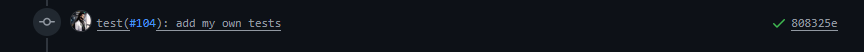
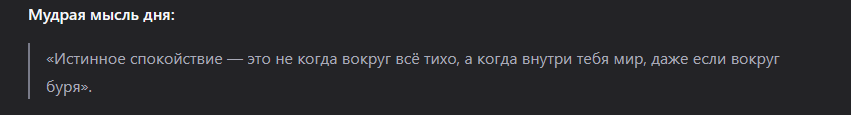

# 📔 Дневник разработчика

**Дата:** 2026-03-16

---

Не, ну я думаю, пора привыкнуть к тому, что все дневники я пишу исключительно ночью.

## 🔧 Модуль key-storages

На этих выходных написал модуль **key-storages** для хранения JSON-файлов по ключу. Сделал поинты для сохранения, создания, обновления, удаления данных и поставил их открытыми для всех для теста.

Задумка, подложенная Сасариком, была в том, чтобы каждый из участников сам себе сохранял данные по ключу и в дальнейшем их использовал для своих нужд. Довольно простая идея и простая реализация, которая позволила бы гибко использовать какие угодно данные для каждого из участников, если они ещё не определились со структурой данных для использования. Это освободило бы меня от реализации многих моделей для разных игр.

В целом, это работает так, как и задумывалось, но возникли проблемы с обновлением данных: при обновлении они полностью заменяют те, что были. Я пытался реализовать частичное обновление, но у меня не получилось. По предложениям из интернета можно было использовать сырые запросы через призму к БД или же писать большие конструкции. А надо ли оно? Для маленьких объёмов данных, где не очень много записей и всё может поместиться в один запрос, использовать вполне можно. Однако данная реализация не подошла под данные, предложенные Аленой для её игры.

## 📊 Планы на следующую неделю

Объём необходимых данных и количество нужных строк — очень много, потому я реализую на следующей неделе модель для её игры с необходимыми эндпоинтами. Открою только один путь для получения всех карточек и одной по `id`.

Сохранение / создание / обновление / удаление будут закрыты гвардом, и ещё будет проверка на роль, так как нельзя давать эти роуты всем желающим — нужно открыть только для тех пользователей с тегом **Admin**.

Не думаю, что написание новой модели займёт много времени. На этой неделе у меня будет интервью, попытаюсь написать быстрее и начать подготовку к нему.

У меня были в планах написать AI-агент на серве со стримами, если хранилище отработает так, как задумывалось. Конечно, увы, пока придётся отложить это на потом. Сами запросы я хотел реализовать без использования библиотек, на обычных запросах и стримах.

## ✅ Тесты

По недельному заданию нужно было добавить 5 тестов. Самостоятельно я их написал для модуля **key-storage**. Не знаю, как это будут проверять, но оставлю тут ссылку на PR: [PR#105](https://github.com/ngKittyDebug/RS-Tandem-ngKittyDebug/pull/105). Тесты, которые я написал, идут последним коммитом.



Жаль, что не получилось с хранилищем так, как задумывалось изначально. Может, придумают, как ещё можно их использовать. Или я просто их выпилю, если они будут не нужны.

## 🎮 Модель для игры Алены

Для игры Алены быстро накидал возможную модель по предоставленному интерфейсу. Получилось пока так:

```ts
model MergeGameData {
  id       Int      @id @default(autoincrement())
  category String
  words    Word[]

  @@map("merge_game_data")
}

model Word {
  id        Int             @id @default(autoincrement())
  word      String
  dataId    Int
  data      MergeGameData   @relation(fields: [dataId], references: [id], onDelete: Cascade)
  questions Question[]

  @@map("merge_game_word")
}

model Question {
  id       Int      @id @default(autoincrement())
  question String
  answer   String
  keywords String[]
  wordId   Int
  word     Word     @relation(fields: [wordId], references: [id], onDelete: Cascade)

  @@map("merge_game_question")
}
```

## 🎬 Заключение

И, на этом всё.

Маловато, да? Но и событий было не так уж и много. Думаю, что с реализацией модели для игры, а также AI-модуля записи будут поинтереснее.

---

### 💡 Мысль дня




Для оформления опять запущу ИИшку
