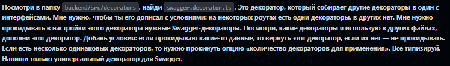
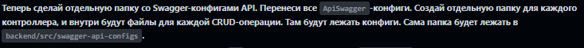
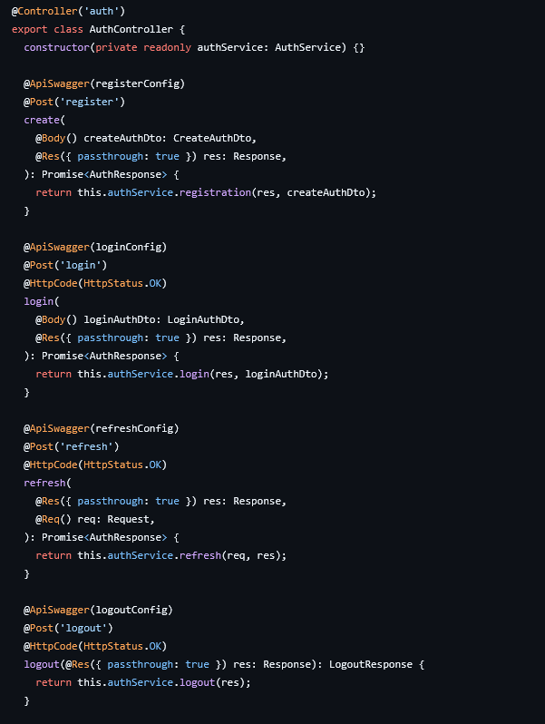
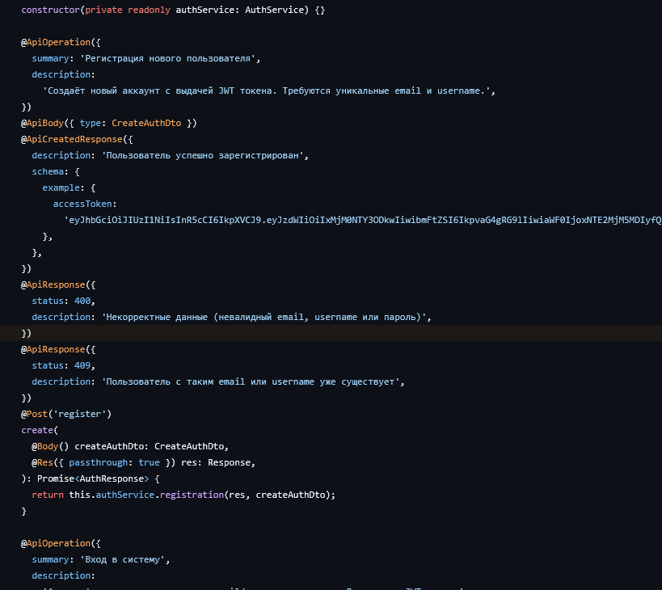
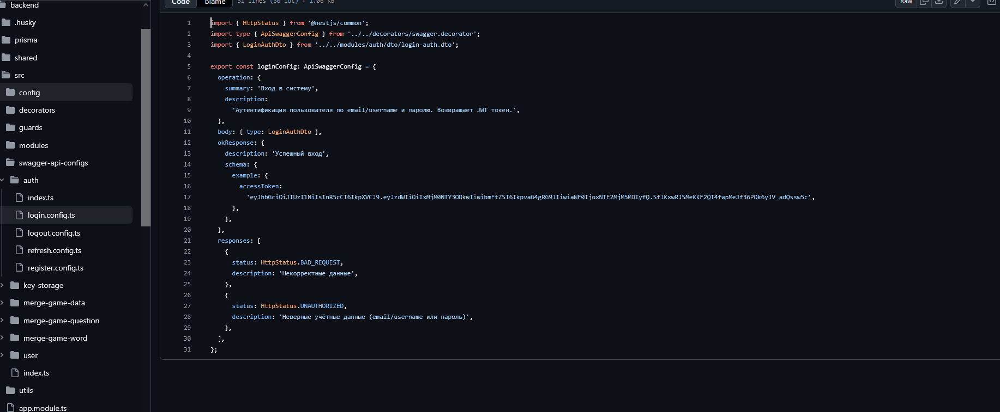

**Дата:** 2026-03-20

На этой неделе реализовал круд операции БД для игры merge-game. Интерфейс и структура получились не очень удобные, когда одна табличка ссылается на другую табличку которая ссылается ну другие таблички.

Коли попросили реализовать такую, моя задача реализовать. 

Модель осталась такая же как и в прошлом дневнике. Сама реализация круд операций достаточно простая и нужно однотипные операции для всех табличек. Когда я написал первые круд операции для первой таблички, мне пришла в голову мысль, почему я должен ее заполнять самостоятельно, когда можно использовать ИИ? я дал ему задачу, посмотреть в мою папку и на мою реализацию круд операция и применить ее для оставшихся двух табличек, и, если он заметит что можно улучшить или поправить, пусть напишет мне об этом по окончании операции.

Заполнил он данные быстро, а так же предложил добавить запросы фильтра и пагинации использую квери параметры и так же использовать транзакции в одной из операции, и я дал добро на это изменения. 

Я все протестировал на бд в докере, заполнив ее тестовыми данными. И после того как протестировал сделал па и дал ссылку на предеплой сервера для alena1409, и вместе мы заполнили данными бд попутна слушая мои жалобы на структуру табличек.

Так же мы с ней реализовали ИИ модель на бэке сидя в воисе. Простая реализация, так же, если нужно будет сменить модель, ключ или юрл, мы запихали эти данные в .env файл. Теперь при необходимости мы сможем поменять все это.

На этой неделе я закрою все роуты для игры, дабы они были открыты только зарегистрированных пользователей, и так же добавлю на часть роутах роль гварды, еще в начале недели я попросил создать учетки чтобы я мог им выдать админ права, но, похоже, ребята забыли.

Роль гварды поставлю на те операции, где нужно изменять, удалять, добавлять новые данные.

Так же мою реализацию хранилища ключей решил использовать pavelkuvsh1noff, хоть я и сказал что это была не очень удачная идея и я предложил сделать отдельную таблицу для игры.

Так же решил отрефачить свагер доку, мне очень не нравилось использование кучи свагер декораторов на каждую круд операцию, и решил поискать как можно сделать кастомный декоратор, который будет возвращать декоратоты, оказалось что в несте это было предусмотрено и есть уже готовое решение, нужно только пробросить какие декораторы нужно будет применить.

Составляя интерфейс для конфигов для каждого декоратора, пришла мысль, почему бы ее не сделать так, чтоб-ы количество аргументов и длинны масивов не возвращались нужные декораторы? И, так как это документация, я решил это доверить ии, и я ему написал  указания что я хочу от него получить. 

тут текст отредактирован, сорян, я безграмотное существо. 

Даже с таким кривым запросом он понял что я от него хочу, и он выдал мне функцию декоратор который возвращает декораторы в зависимости от конфига, я только немного его отрефачил и поправил типизацию, в некоторых местах он придумал свою, а не использовал готовую.

Следующим заданием, я попросил его применить новый декоратор для всех круд операций и прокинуть туда конфиги из них.

;

Успешно, он полностью заменил все декораторы на новый кастомный и сделал конфиги.

Да, это сократило количество декораторов, но не сократило количество строк в контроллерах. Так что следующим этапом, я дал такое указание: 

)

Ну, что я могу сказать, четко, быстро, красиво, теперь для каждого декоратора есть свой конфиг который лежит в отдельной папке. Теперь у меня нет раздутых контролеров

а было:

и теперь конфиги выглядят так: 

Теперь мне не придется лазить по контроллерам и искать нужную строку, теперь есть отдельные конфиги где я могу быстро все поправить при необходимости.

А так же написать новые для новых круд операций, (или дам задание ии их заполнить).

По планам что нужно доделать, закрыть часть роутов, поставить роль гварды, спросить у Маши младшей когда будет готов сервис аватарок.

Так же я хотел еще реализовать ИИшку со стримами, но на этой неделе кор интервь, может на выходных успею написать (если буду еще живой).

И тут все, более не о чем писать.

Передаю ИИ рукопись:

З.Ы. Я что, теперь вайбкодер, да? да?
