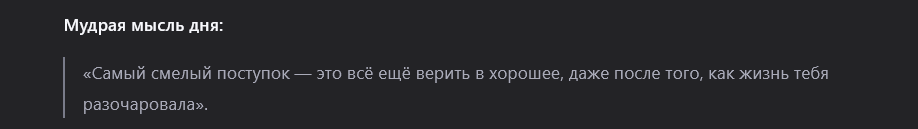

**Дата:** 2026-03-

Как я и планировал, в конце этой недели я сдал интервью. Из-за подготовки к нему, я сделал не очень много на этой неделе, все что было описано в прошлом дневнике, плюс вчера я написал рол гварды и повесил на те круд операции которые создают\обновляют\удаляют данные с сервера, и убрал публичный декоратор для всех роутов кроме модуля auth.

В начале идет проверка на токен и его валидация и расшифровка, далее если все прошло успешно, идет проверка роль гварда, если нет декоратора с ролью,  то он пропускает дальше, если есть декоратор, рольгвард получает пейлоад в котором была зашифрована роль пользователя и идет проверка, если пользователь админ, то пропустить, иначе кинуть ошибку доступа. Все просто и понятно.

в прошлом дневнике я написал все что делал, потому лить воды тут не зачем.

Вот сам ПР:

[PR#131](https://github.com/ngKittyDebug/RS-Tandem-ngKittyDebug/pull/131)

Обновил сваггер вики.

На следующей неделе будет "софт" деадлайн, потому будем собирать приложение в единое целое и фиксить баги.

Я еще планирую, если будет время, добавить все таки ИИ со стримами, сервис для сохранения аватарок, только не знаю, реализовывать его на сервере, или залезть во фронт и там его написать и только отсылать на сервер ссылку на новую аву, я потом спрошу у Маши, будет ли она его делать или не успеет.

Так же, если нужно будет, сделаю новые модели табличек если команде они будут нужны.

Более не о чем писать, получилось мало, так как была подготовка к интервью.

На этом все.

