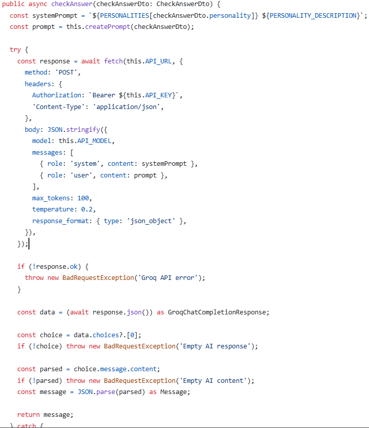
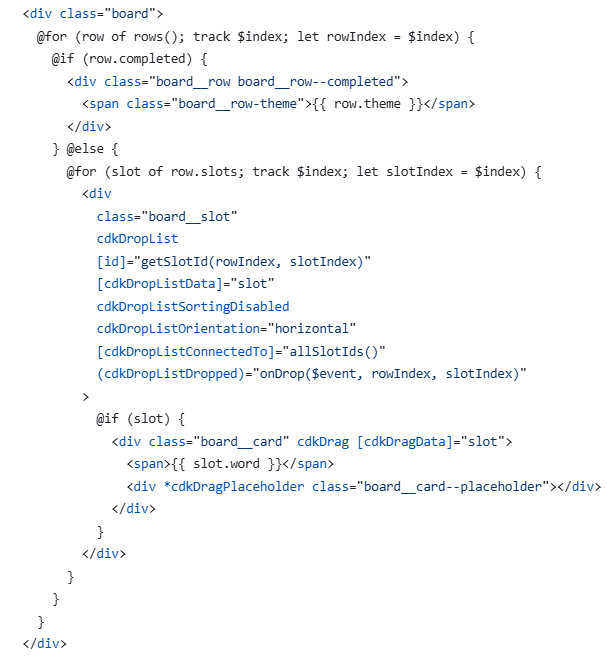
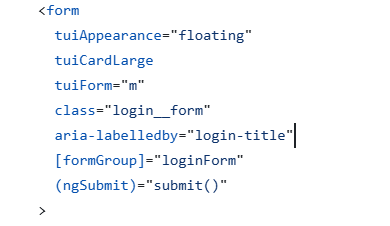
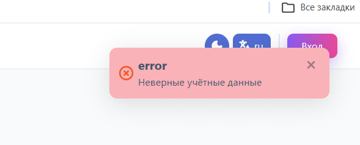
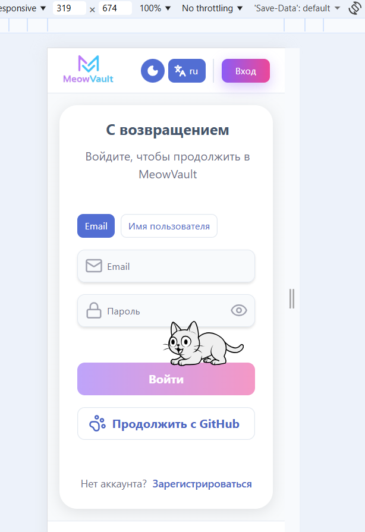
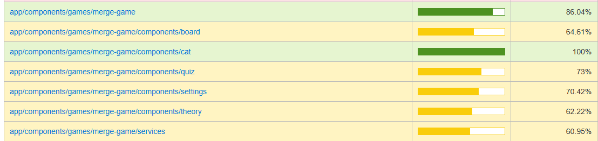
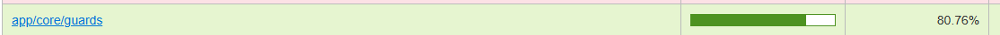
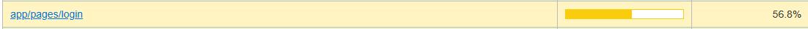

# Self-Assessment - Alena Alekseeva (Alena1409)

PR with questions from peers and mentor: [link](https://github.com/ngKittyDebug/RS-Tandem-ngKittyDebug/pull/224)

## Feature Score Table

| Категория            | Фича                                                                                                                   | Баллы              | Ссылка / подтверждение | Комментарий |
| -------------------- | ---------------------------------------------------------------------------------------------------------------------- | ------------------ | ---------------------- | ----------- |
| **My Components**    | **Complex Component:** Разработка сложного интерактивного компонента (Game Board, Widget Engine, Chat UI, Code Runner) | +75 (25 за каждый) | [PR #36](https://github.com/ngKittyDebug/RS-Tandem-ngKittyDebug/pull/36), [PR #106](https://github.com/ngKittyDebug/RS-Tandem-ngKittyDebug/pull/106), [PR #136](https://github.com/ngKittyDebug/RS-Tandem-ngKittyDebug/pull/136) | 1. Страница логина с реактивной формой, переключением режима входа и кастомной валидацией. 2. Board component для merge-game с Drag & Drop логикой. 3. Quiz block/page с проверкой ответов в AI и non-AI режимах. |
|                      | **Rich UI Screen:** Реализация экрана со сложной логикой и состоянием (Dashboard, Library с фильтрами, Profile, Lobby) | +40 (20 за каждый) | [PR #106](https://github.com/ngKittyDebug/RS-Tandem-ngKittyDebug/pull/106) | 1. Страница настройки игры с выбором режима, личности AI и количества вопросов. 2. Страница теории для merge-game с отдельным роутингом внутри игры. |
|                      | **Сложный бэкенд-сервис:** Game Server Engine, Matchmaking System, AI Context Manager, Code Execution Sandbox          |      +30        | [PR #136](https://github.com/ngKittyDebug/RS-Tandem-ngKittyDebug/pull/136) | Бэкенд-часть AI для merge-game: endpoint проверки ответов, DTO/enum, защита endpoint, обработка ответа AI.|
| **Backend & Data**   | **Backend Framework:** Использование серверного фреймворка (NestJS, Express, Fastify, Koa)                            | +10                | [PR #136](https://github.com/ngKittyDebug/RS-Tandem-ngKittyDebug/pull/136) | Работала с NestJS в задаче AI для merge-game: модуль, DTO, endpoint, правки по review. |
|                      | **API Documentation:** Swagger/OpenAPI или аналогичная документация API                                                | +5                 | [PR #136](https://github.com/ngKittyDebug/RS-Tandem-ngKittyDebug/pull/136) | Добавляла и исправляла Swagger-описания для AI endpoint, правила enum и текстовые правки в документации. |
| **AI**               | **AI Chat UI:** Интерфейс чата с отправкой промпта и отображением ответа LLM                                           | +20                | [PR #136](https://github.com/ngKittyDebug/RS-Tandem-ngKittyDebug/pull/136) | В игре реализован AI-режим: отправка ответа пользователя на backend и вывод AI feedback в процессе проверки ответов. |
|                      | **Raw LLM API:** Интеграция без "magic" SDK (использование native fetch + ReadableStream)                             | +10                | [PR #136](https://github.com/ngKittyDebug/RS-Tandem-ngKittyDebug/pull/136) | Интеграция AI без SDK через `fetch`: отдельно разбирала `response.ok`, `response.json()` и обработку невалидного JSON ответа. |
| **UI & Interaction** | **Drag & Drop:** Реализация перетаскивания (Kanban, сортировка, конструктор)                                           | +10                | [PR #106](https://github.com/ngKittyDebug/RS-Tandem-ngKittyDebug/pull/106) | Реализовала Drag & Drop в merge-game на Angular CDK, настраивала `cdk-drag-preview`, placeholder и поведение слотов. |
|                      | **Advanced Animations:** Сложные анимации переходов или микро-взаимодействия                                           | +10                | [PR #106](https://github.com/ngKittyDebug/RS-Tandem-ngKittyDebug/pull/106), [PR #181](https://github.com/ngKittyDebug/RS-Tandem-ngKittyDebug/pull/181) | Кастомная анимация drag preview с градиентом и отдельный компонент кота с двигающимися глазами для login/game UI. |
|                      | **Theme Switcher:** Переключение тем (Light/Dark) через CSS variables или Context                                      | +10                | [PR #106](https://github.com/ngKittyDebug/RS-Tandem-ngKittyDebug/pull/106) | Подключала и доправляла поддержку темы в своих экранах, работала с переменными стилей и правками после merge команды. |
|                      | **i18n:** Локализация интерфейса (минимум 2 языка) с переключением                                                     | +10                | [PR #106](https://github.com/ngKittyDebug/RS-Tandem-ngKittyDebug/pull/106) | Использовала Transloco в своих компонентах, реализованы русский и английский язык.|
|                      | **Accessibility (a11y):** Оптимизация доступности (aria-labels, keyboard navigation, Audit pass)                      | +10                | [PR #36](https://github.com/ngKittyDebug/RS-Tandem-ngKittyDebug/pull/36), [PR #106](https://github.com/ngKittyDebug/RS-Tandem-ngKittyDebug/pull/106) | Базовая доступность интерактивных элементов в логине и игре: форма, валидация, управляемая навигация и использование UI библиотек с keyboard-friendly поведением. Испольозвание aria-labelledby на странице логин, возможность войти с помощью кнопки "ENTER", использование всплывающего окна указыающий на какие-то ошибки при логине  |
|                      | **Responsive:** Адаптация верстки под мобильные устройства (от 320px)                                                  | +5                 | [PR #106](https://github.com/ngKittyDebug/RS-Tandem-ngKittyDebug/pull/106) | Отдельно правила адаптива для своих экранов: есть коммит с правками adaptive layout и замечания по адаптиву в ревью.  |
| **Quality**          | **Unit Tests (Basic):** Покрытие тестами 20%+ вашего личного кода                                                      | +10                | [PR #89](https://github.com/ngKittyDebug/RS-Tandem-ngKittyDebug/pull/89), [PR #106](https://github.com/ngKittyDebug/RS-Tandem-ngKittyDebug/pull/106) | Написаны тесты для `AuthService`, `authGuard`, `guestGuard`, позже добавлены тесты для `boardGuard` и части merge-game. |
|                      | **Unit Tests (Full):** Покрытие тестами 50%+ вашего личного кода (доп. к предыдущему)                                 | +10                | [PR #89](https://github.com/ngKittyDebug/RS-Tandem-ngKittyDebug/pull/89), [PR #106](https://github.com/ngKittyDebug/RS-Tandem-ngKittyDebug/pull/106) | Покрывала сервисы, guards и часть игровых сценариев; дополнительно дописывала тесты после проверки покрытия и замечаний.   |
| **DevOps & Role**    | **Prompt Engineering:** Документирование 3+ итераций улучшения промптов                                                | +15                | [Дневники разработки:](https://github.com/ngKittyDebug/RS-Tandem-ngKittyDebug/tree/main/development-notes/alena1409) [2026-02-19](https://github.com/ngKittyDebug/RS-Tandem-ngKittyDebug/blob/main/development-notes/alena1409/alena1409-2026-02-19.md), [2026-02-26](https://github.com/ngKittyDebug/RS-Tandem-ngKittyDebug/blob/main/development-notes/alena1409/alena1409-2026-02-26.md), [2026-03-13](https://github.com/ngKittyDebug/RS-Tandem-ngKittyDebug/blob/main/development-notes/alena1409/alena1409-2026-03-13.md), [2026-03-11](https://github.com/ngKittyDebug/RS-Tandem-ngKittyDebug/blob/main/development-notes/alena1409/alena1409-2026-03-11.md), 2026-03-29 | Зафиксированы несколько итераций работы с AI: генерация и ручная доработка слов для игры, эксперименты с Groq, разбор тестов в обучающем режиме, поиск решений для Drag & Drop и рефлексия по качеству AI-подсказок. Разработка своей информационной документации на  Github-Wiki|
|                      | **Architect:** Документирование архитектурных решений (схемы, ADR)                                                     | +10                | [Дневники разработки:](https://github.com/ngKittyDebug/RS-Tandem-ngKittyDebug/tree/main/development-notes/alena1409) [2026-02-26](https://github.com/ngKittyDebug/RS-Tandem-ngKittyDebug/blob/main/development-notes/alena1409/alena1409-2026-02-26.md), [2026-03-13](https://github.com/ngKittyDebug/RS-Tandem-ngKittyDebug/blob/main/development-notes/alena1409/alena1409-2026-03-13.md), 2026-03-18, 2026-03-22 | В дневниках зафиксированы архитектурные решения по merge-game: структура данных с `ru/en`, роутинг внутри игры, разделение ответственности между `GameService`, `BoardService`, `QuizService`, перенос AI логики с frontend на backend и адаптация интерфейсов под данные из БД. |
|                      | **Auto-deploy:** Настройка автоматического деплоя (Vercel/Netlify/GH Actions)                                          | +5                 | [PR #181](https://github.com/ngKittyDebug/RS-Tandem-ngKittyDebug/pull/181) | Работа развернута на Netlify с использованием предиплоя, чтобы на этапе осмотра ПР уже можно было посмотреть, как будет выглядеть компонент|
| **Architecture**     | **Design Patterns:** Явное и обоснованное применение паттернов в коде                                                  | +10                | [PR #106](https://github.com/ngKittyDebug/RS-Tandem-ngKittyDebug/pull/106) | Разделила игру по зонам ответственности: `GameService`, `BoardService`, `QuizService`; Использование standalone components, reactive forms, guards, interceptor, signals|
|                      | **API Layer:** Выделение слоя работы с API (изоляция от UI компонентов)                                                | +10                | [PR #36](https://github.com/ngKittyDebug/RS-Tandem-ngKittyDebug/pull/36), [PR #89](https://github.com/ngKittyDebug/RS-Tandem-ngKittyDebug/pull/89), [PR #136](https://github.com/ngKittyDebug/RS-Tandem-ngKittyDebug/pull/136) | Отдельный `AuthService`, interceptor для токена/refresh и вынесенная AI/backend логика отдельно от UI компонентов игры. |
| **Frameworks**       | **Angular:** Использование фреймворка Angular                                                                          | +10                | [PR #36](https://github.com/ngKittyDebug/RS-Tandem-ngKittyDebug/pull/36), [PR #89](https://github.com/ngKittyDebug/RS-Tandem-ngKittyDebug/pull/89), [PR #106](https://github.com/ngKittyDebug/RS-Tandem-ngKittyDebug/pull/106) | Основной личный вклад сделан на Angular: standalone components, reactive forms, guards, interceptor, signals, CDK Drag & Drop, Transloco. |

**Итоговая сумма по фичам: 325 баллов (или мах 250 баллов)**

## Description Of My Work

В рамках дипломного проекта я в основном работала над frontend частью на Angular и частично над backend интеграцией AI для моей игры `merge-game`. Мой основной личный вклад состоял из разработки страницы логина, сервиса аутентификации, interceptor и guards, а также собственной мини-игры с несколькими экранами: настройка игры, доска, квиз и теория.

Для страницы логина я использовала `Reactive Forms`, строгую типизацию, `FormBuilder`, кастомную валидацию, переключение режима входа и отдельный сервис авторизации. Позже я добавила interceptor для токена и refresh-логики, а также тесты для `AuthService` и guards. Это была важная часть моего роста, потому что раньше я не чувствовала уверенности в таких вещах.

Моя игра `merge-game` сначала собиралась на моках, а затем постепенно была адаптирована под реальные данные. Я реализовала Drag & Drop механику на Angular CDK, отдельный роутинг внутри игры, разделение логики между сервисами, guards для игровых экранов, квиз с проверкой ответов и теоретический экран. Дополнительно я сделала AI-режим, при котором ответ пользователя отправляется на backend и возвращается проверка от AI.

В backend части я впервые для себя работала с NestJS. Я участвовала в реализации AI endpoint для проверки ответов, правилах DTO, Swagger-описании и исправлениях по code review. Отдельно пришлось разбираться с безопасностью endpoint, обработкой `fetch` ответа и невалидного JSON.

В процессе проекта я активно использовала AI как помощника, но не как источник готовых решений без проверки. ChatGPT, Claude и другие инструменты помогали мне разбирать документацию, тесты, механику Drag & Drop и backend интеграцию, но все рабочие решения я перепроверяла и дорабатывала вручную. Этот проект дал мне хороший опыт в том, как использовать AI осознанно, а не слепо.

Самыми сложными для меня частями были backend интеграция, тесты, interceptor, guards и перенос AI логики с frontend на backend. При этом именно эти части дали мне самый заметный рост. По итогам проекта я стала намного увереннее в Angular, работе с API, разбиении логики по ответственности и постепенной реализации сложных задач.

## Two Personal Feature Components

### 1. Login Page + Auth Flow

Это один из двух компонентов, которые я считаю полностью своими и на которых готова делать акцент на презентации. В этой части я лично реализовала:

- страницу логина на Angular
- реактивную форму со строгой типизацией
- кастомную валидацию
- переключение между режимами входа
- `AuthService`
- interceptor
- guards
- тесты для auth-related логики

Почему я выделяю этот компонент:
именно здесь я сама глубоко разбиралась в Angular forms, auth flow, interceptor, guards и тестировании.

### 2. Merge Game

Второй ключевой личный компонент - моя мини-игра `merge-game`. В этой части я лично реализовала:

- экран настроек игры
- доску с Drag & Drop
- экран квиза
- экран теории
- роутинг внутри игры
- разделение логики на сервисы
- guards для игровых состояний
- AI и non-AI режимы проверки ответов
- часть backend интеграции для AI

Почему я выделяю этот компонент:
это моя основная feature в проекте, которую я строила поэтапно от прототипа на моках до рабочей версии с backend интеграцией. Здесь хорошо видно и мою frontend работу, и архитектурные решения, и рост в сторону backend/AI.
