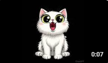

# Дата: 2026-03-20

- **Что было сделано:**
Сегодня прошел очередной митап, где мне здорово помогли с тем, что у меня не получалось. Все-таки я новичок в Angular и делаю там свои первые, пусть очень корявые, но шаги. На первый взгляд вроде бы все просто, но много нюансов, воторые я просто не знаю. Мне объяснили, как подключать компоненты из Тайги и вообще как все должно быть. Мне очень понравились работы других членов команды, они очень классные, особенно форма регистрации с котиком.

- **Мой личный вклад:**
Сегодня я продолжила делать страницу 404, наконец-то сделала там оформление с гифкой с анимированным котом. Ох этот кот. Мне так жаль, что нельзя было оставить его со звуком, поэтому пусть будет хотя бы здесь. Вчера смеялись с него весь вечер. Даже моей кошке понравился его голос.

Еще я подключила компонент из Тайги. У меня получилось, но я не закончила, еще предстоит разобраться с роутингом и ссылками. Все это заняло у меня довольно много времени, вроде бы процедура простая, но чтобы разобраться и решить возникшие проблемы, ушел просто весь вечер.

- **Проблемы:**
У меня никак не подключалась картинка, вернее, она не отображалась при запуске через npm start. Также оказывается с моей страницей был какой-то баг, но его исправили раньше, чем я успела с ним столкнуться.

- **Решения:**
Картинки с папкой assets были перенесены в puplic и был изменен путь, чтобы начинался с assets. Вроде несложно, но почему-то не получалось. Все получилось при моральной поддержке и подсказке Alex GorSer.

- **Планы:**
Доделать эту страничку, доделать MainPage и приступить уже к игре.

- **Затраченное время:**
3 часа - митап + 2-3 часа - страница 404, Тайга, проблемы и все вышеописанное.

- **Мысли:**
Надо чаще советоваться с командой, пока я тут сижу наедине с проблемами, они кажутся неразрешимыми. Мне кажется, что эти проблемы из-за того, что я все сломала. А потом оказывается, что они как-то просто решаются и все о них знают.