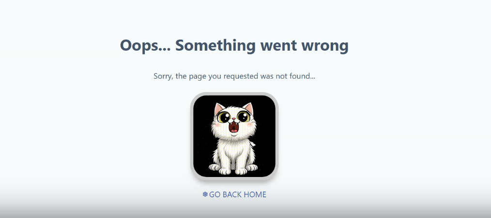

# Дата: 2026-03-30
- **Что было сделано:**
Готова страница 404:
[Ссылка на PR](https://github.com/ngKittyDebug/RS-Tandem-ngKittyDebug/pull/67)
В процессе главная страница, на прошедшем митапе мы решили немного поменять ее концепцию.
Видеоотчет по выполненной работе:

- **Мой личный вклад:**
Выполняла свои 2 задачи, участвовала в митапе.

- **Проблемы:**
Проблемы возникли в процессе интеграции некоторых компонентов Taiga UI, почему-то для них требовалась установка новой версии Taiga, а это бы сломало весь проект, в итоге проект сломался только у меня локально.

- **Решения:**
Пришлось удалить папку frontend и подгрузить ее заново из удаленного репо. Видимо, придется не использовать те компоненты, которые не получается импортировать, но это очень обидно, поэтому я еще попытаюсь решить эту проблему.

- **Планы:**
Закончить с главной страницей и начать игру.

- **Затраченное время:**
Честно говоря, мне трудно его подсчитать, за исключением митапа, который длился 2 часа.

- **Мысли:**
Нужно работать быстрее, но пока у меня не получается.
