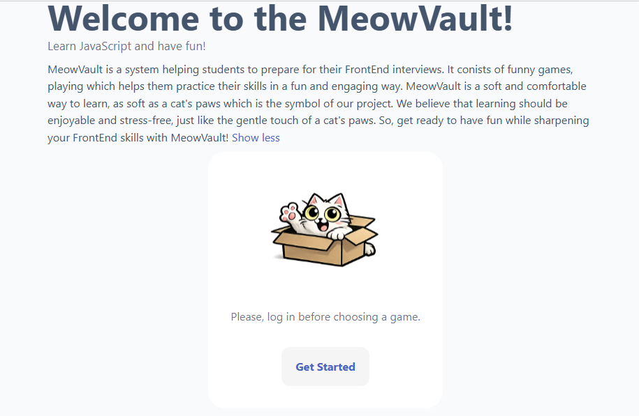
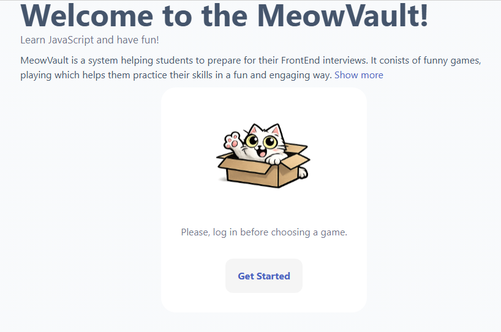

# Дата: 2026-03-08

- **Что было сделано:**
Сегодня я продолжала работать над главной страницей и добавила в нее блок elastic-container с текстом - описанием, который может раскрываться и сжиматься. Почему была выбрана такая функция: мне показалось это красивым способом оформить описание с помощью UI-компонентов.
Также я добавила окно с кнопкой Get Started, которая ведет на страницу регистрации.
Выглядит это все вот так:
;
;

- **Проблемы:**
1. Пока не знаю, как настроить роутинг, чтобы пользователь по кнопке GetStarted попадал на страницу регистрации, а с нее на страницу с карточками.
2. У меня сломалась (опять) версия Taiga.
3. Я запушила в дневники не то.

- **Решения:**
1. Пока не знаю как решить, нужно советоваться с командой.
2. Решилось переустановкой зависимостей. Не сразу, но наконец я запомнила всю нужную последовательность.
3. Спасибо тимлиду за исправление моего косяка. Надеюсь, я его больше не повторю.

- **Планы:**
В ближайшее время настроить роутинг и закончить главную страницу, начать игру.

- **Затраченное время:**
Где-то 2 часа, большая часть из которых ушла на более подробное изучение Taiga UI компонентов.

- **Мысли:**
Чем больше мы изучаем... Тем больше мы изучаем.