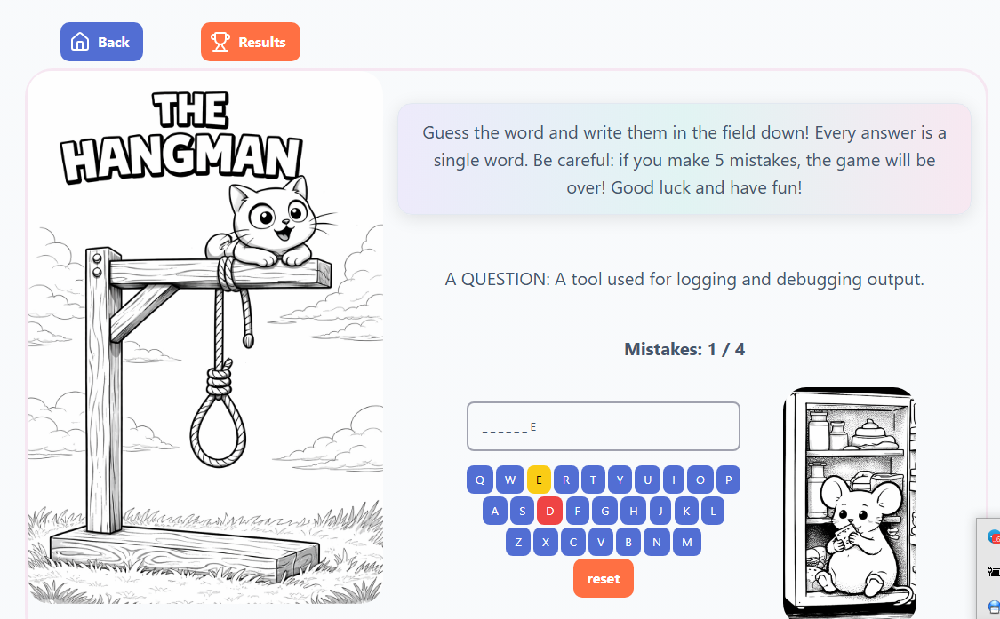
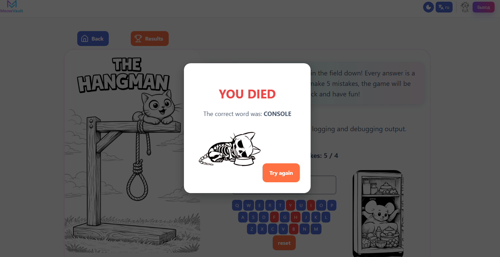
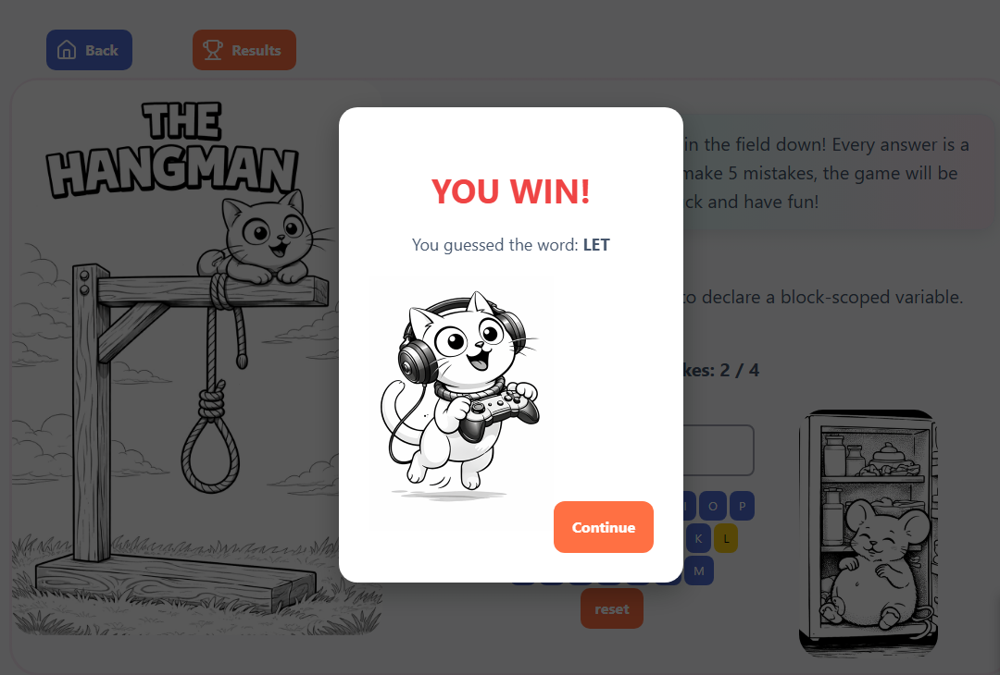

# Дата: 2026-03-28

- **Что было сделано:**
Cегодня был мит, на которой мы с командой представляли свою работу. Нам зачли это как техническое собеседование. Каждый рассказал про свои компоненты, их техническую сторону, какие технологии были использованы, какие трудности были.
Я выступила, на мой взгляд, не очень хорошо, но мне поставили почти максимальный балл. Снизили немного "за коммуникацию". Что нужно было увереннее говорить о себе. Но я не согласна с этим, что значит увереннее говорить о себе, это пытаться выглядеть не хуже других членов команды? Но это неправда, я знаю реально меньше всех, работаю медленнее и сделала меньше всех. Моих знаний и в общем-то когнитивных способностей пока что недостаточно для освоения сложных технологий. Так что не вижу смысла притворяться.

- **Мой личный вклад:**
Я доделала карточки игр и сделала разделение состояний игры на экран для зарегистрированного и не зарегистрированного пользователя. Сделала ссылку на страницу регистрации и ссылки на страницы игр (пока не все). Пришлось немного поразбираться с роутером, по итогу это оказалось не так уж сложно.
Отражено в ПР:
[главная страница](https://github.com/ngKittyDebug/RS-Tandem-ngKittyDebug/pull/188);
Также я доделала основную логику игры, теперь там можно ввести слово с помощью виртуальной клавиатуры, оно сравнивается с ответом, нажатые клавиши окрашиваются разными цветами: красным, если ошибка, желтым, если верно. Меняется картинка, при каждой ошибке, где мышь съедает всю еду в холодильнике. При выигрыше и проигрыше появляются модальные окна.
Картинки:
;
;
;
- **Проблемы:**
Проблемы были с роутингом и с тем, что не могу сделать ссылки на все игры, пока компоненты не добавлены.

- **Решения:**
Решу, когда будет все замерджено.

- **Планы:**
1. Сделать фичу "глаза котика";
2. Переверстать карточки с новыми картинками;
3. Добавить оставшиеся ссылки;
4. Сделать версию для мобильных устройств (оставить маленькие картинки тоже, по возможности);
5. Закончить логику игры: добавить возможность выбора уровня сложности, модальные окна при прохождении уровня полностью.
6. Придумать, как будут храниться результаты игры, и реализовать их представление и/или хранение.

- **Затраченное время:**
последние 2 дня, почти целый день (с перерывами на сон, еду)

- **Мысли:**
Я научилась очень многому, благодаря сильной команде, в которую я попала. По сравнению с тем, что было, мой уровень значительно повысился. Но нужно еще очень многому научиться, и понадобится время, чтобы поверить, что у меня что-то получается. Очень сложно избавиться от мысли, что программирование - это что-то совсем не мое. Если честно, то это очень чувствительный момент, я никому не рассказываю о своем обучении, кроме узкого круга близких людей, так как не хочу столкнуться с критикой или обесцениванием, а также я не строю никаких планов насчет работы, чтобы не разочаровываться, так как понимаю, что пока что не выдерживаю никакой конкуренции. Однако, мне нужно научиться хотя бы изображать уверенность, "потому что это нравится работодателю" (вряд ли я скоро попаду к нему). Я могу попробовать, просто потому что так нужно, но это будет не совсем искренне.