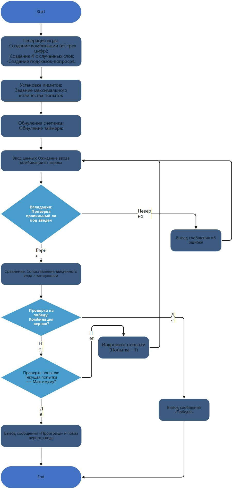

#Дата: 2026-03-08

- **Что произошло**:
Окончательно определился с правилами игры, которую разрабатываю. В итоге решил использовать оригинальные правила игры "Decrypto" или "Декодер" с поправкой на то что игра будет разрабатываться для соло режима в данный момент. Сделал блок-схему игры.

[]

На последнем митапе договорились добавить кнопку "log out" и автарку пользователя. Комоненты добавил.

- **Результат**:
  Победа

- **Вывод:** 
Продумал базовые интерфейсы для игры. Продумал дизайн игры и расположение основных блоков. Продумал окончатительные правила игры. Также добавил два компонента: кнопку "log out" и автарку пользователя. Компоненты полностью еще не готовы. В ближайшее время их закночу и приступаю плотно к разработке самой игры.
Да пребудет с нами сила...