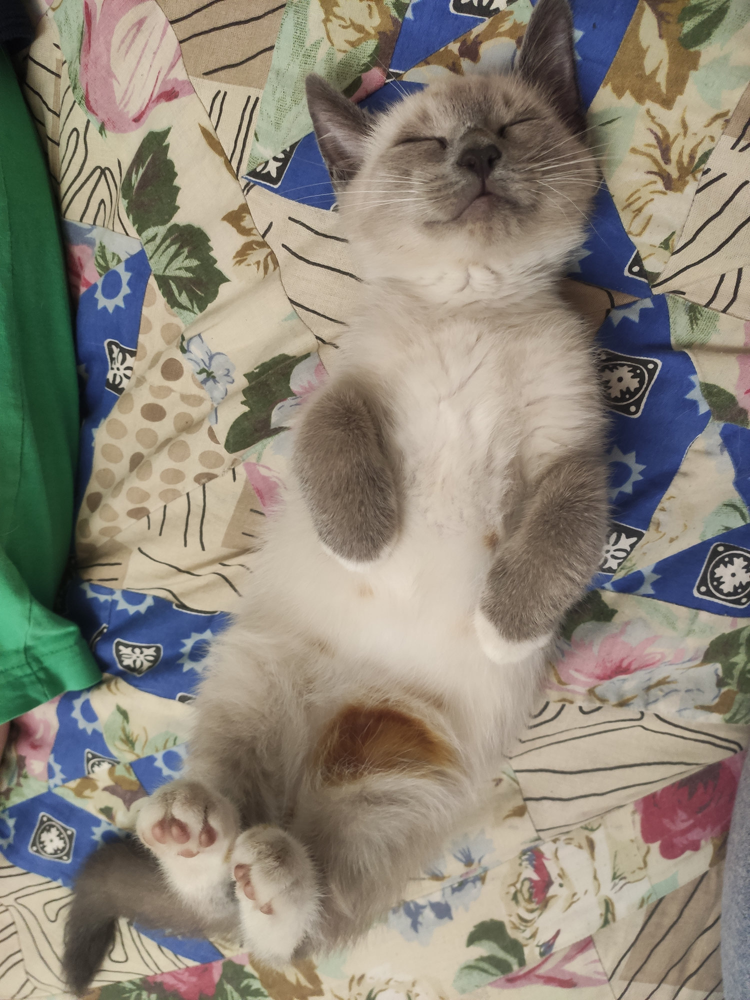

#Дата: 2026-03-30

**Что произошло**:
Последний дневник в рамках проекта.

Нашел маленькие баги в игре. Уже их исправил.

Также подправил некоторые тесты выполненных компонентов, чтобы поднять тестовое покрытие.

Попробовал добавить ии-агента. Очень долго мучался с этим. Очень хотел внедрить модель google/gemma-3-4b-it с помощью разных вариантов описанных на https://huggingface.co. В интернете нашел информацию что данная модель бесплатная, но у меня ничего не получилось. Очень много времени потратил. Пробовал как прямой метод внедрения ии-агента так и с помощью библиотеки. В итоге решил попробовать модель Qwen/Qwen3-32B. Сразу получилось ее внедрить с помощью расширения. Так же получилось настроить запрос. Получал необходимые данные для игры, так же в нужном формате. Но у меня уже не хватило времени настроить режим игры с ии. В последний день решил что лучше исправить все недочеты и сделать тесты для компонентов.

**Результат**:

Пожалуй ничья

**Вывод:** 

Вот и закончилось путешествие. Изучил много нового. Познакомился с angular. Обязательно продолжу его изучать. 

Получилось таки подключить ии агента, но не хватило времени для полноценного внедрения в игру. Нужно работать над собой чтобы успевать как можно больше. Нашел маленькие баги в игре которые исправил. Также решил дописать тесты к компонентам.

Все таки накопилась усталость о которой не писал. Перед следующим этапом есть время отдохнуть и набраться сил для следующего "путешествия". Посетим планету по изучению angular. Может куда-нибудь еще заглянем. В любом случае немного передохнем...

А после подзаправимся и полетим дальше. В далекой далекой галактике еще очень много интересного. В любом случае дневник в этой главе последний, но скоро начнется новая.

Да пребудет с нами сила...