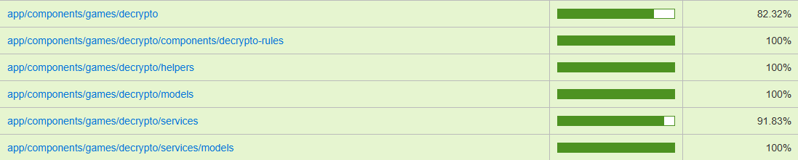
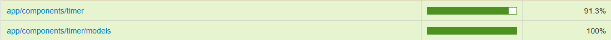
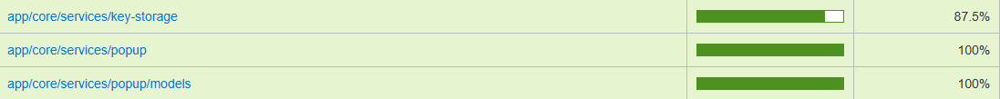

# Self-Assessment

PR with questions from peers and mentor: [link](https://github.com/ngKittyDebug/RS-Tandem-ngKittyDebug/pull/237)

## Feature Score Table

| Категория            | Фича                                                                                                                   | Баллы              | Ссылка / подтверждение | Комментарий |
| -------------------- | ---------------------------------------------------------------------------------------------------------------------- | ------------------ | ---------------------- | ----------- |
| **My Components**    | **Complex Component:** Разработка сложного интерактивного компонента (Game Board, Widget Engine, Chat UI, Code Runner) | +125 (25 за каждый)| [PR #24](https://github.com/ngKittyDebug/RS-Tandem-ngKittyDebug/pull/24), [PR #57](https://github.com/ngKittyDebug/RS-Tandem-ngKittyDebug/pull/57), [PR #83](https://github.com/ngKittyDebug/RS-Tandem-ngKittyDebug/pull/83), [PR #146](https://github.com/ngKittyDebug/RS-Tandem-ngKittyDebug/pull/146), [PR #190](https://github.com/ngKittyDebug/RS-Tandem-ngKittyDebug/pull/190) | 1. Компонент нотификации. 2. Игра Decrypto. 3. Таймер прямого и обратного отсчета. 4. Сервис по работе с хранилищем данных на сервере. 5. Сервис по работе с игровой статистикой.|
|                      | **Rich UI Screen:** Реализация экрана со сложной логикой и состоянием (Dashboard, Library с фильтрами, Profile, Lobby) | +20 (20 за каждый) | [PR #24](https://github.com/ngKittyDebug/RS-Tandem-ngKittyDebug/pull/24), [PR #83](https://github.com/ngKittyDebug/RS-Tandem-ngKittyDebug/pull/83) | 1. Общий компонент приложения header с компонентами переключения тем и локализации, ссылкой на страницу пользователя с текущей аватаркой и кнопка входа и выхода|
| **Game**             | **Leaderboard:** Таблица рекордов с сохранением результатов между сессиями                                             | +5                 | [PR #146](https://github.com/ngKittyDebug/RS-Tandem-ngKittyDebug/pull/146) | Реализована система игровых достижений в игре Decrypto |
| **UI & Interaction** | **Advanced Animations:** Сложные анимации переходов или микро-взаимодействия                                           | +10                | [PR #190](https://github.com/ngKittyDebug/RS-Tandem-ngKittyDebug/pull/190) | Использование кастомной анимация при загрузке страницы и ожидания ответов о сервера в игре(preloadera) |
|                      | **Theme Switcher:** Переключение тем (Light/Dark) через CSS variables или Context                                      | +10, +10           | [PR #24](https://github.com/ngKittyDebug/RS-Tandem-ngKittyDebug/pull/24) | Подключение, настройка и использование темной и светлой темы в приложении. |
|                      | **i18n:** Локализация интерфейса (минимум 2 языка) с переключением                                                     | +10, +10           | [PR #24](https://github.com/ngKittyDebug/RS-Tandem-ngKittyDebug/pull/24) | Подключение, настройка и использование библиотеки интернационализации Transloco. |
|                      | **Accessibility (a11y):** Оптимизация доступности (aria-labels, keyboard navigation, Audit pass)                       | +10                | [PR #24](https://github.com/ngKittyDebug/RS-Tandem-ngKittyDebug/pull/24), [PR #83](https://github.com/ngKittyDebug/RS-Tandem-ngKittyDebug/pull/83), [PR #146](https://github.com/ngKittyDebug/RS-Tandem-ngKittyDebug/pull/146) |  Базовая доступность интерактивных элементов в header и игре decrypto: форма отправки кода в игре, управляемая навигация в игре и использование UI библиотек с keyboard-friendly поведением. |
|                      | **Responsive:** Адаптация верстки под мобильные устройства (от 320px)                                                  | +5                 | [PR #190](https://github.com/ngKittyDebug/RS-Tandem-ngKittyDebug/pull/146) | Отдельным комитом добавлял адаптив для игры |
| **Quality**          | **Unit Tests (Basic):** Покрытие тестами 20%+ вашего личного кода                                                      | +10                | [PR #24](https://github.com/ngKittyDebug/RS-Tandem-ngKittyDebug/pull/24), [PR #57](https://github.com/ngKittyDebug/RS-Tandem-ngKittyDebug/pull/57), [PR #146](https://github.com/ngKittyDebug/RS-Tandem-ngKittyDebug/pull/146), [PR #190](https://github.com/ngKittyDebug/RS-Tandem-ngKittyDebug/pull/190) | Написаны тесты для всех создаваемых компонентов |
|                      | **Unit Tests (Full):** Покрытие тестами 50%+ вашего личного кода (доп. к предыдущему)                                  | +10                | [PR #109](https://github.com/ngKittyDebug/RS-Tandem-ngKittyDebug/pull/109), [PR #119](https://github.com/ngKittyDebug/RS-Tandem-ngKittyDebug/pull/190), [PR #210](https://github.com/ngKittyDebug/RS-Tandem-ngKittyDebug/pull/210) | Исправлял тесты и дополнительно дописывал тесты после проверок|
| **DevOps & Role**    | **Architect:** Документирование архитектурных решений (схемы, ADR)                                                     | +10                | [Дневники разработки:]() 2026-03-08, 2026-03-12, 2026-03-20, 2026-03-23 | В дневниках зафиксированы архитектурные решения по игре Decrypto/Декодер: блок-схема разрабатываемой игры, отражен процесс разработки игровых компонентов и сервисов |
|                      | **Auto-deploy:** Настройка автоматического деплоя (Vercel/Netlify/GH Actions)                                          | +5                 | [PR #210](https://github.com/ngKittyDebug/RS-Tandem-ngKittyDebug/pull/210) | Работа развернута на Netlify |
| **Architecture**     | **Design Patterns:** Явное и обоснованное применение паттернов в коде                                                  | +10                | [PR #146](https://github.com/ngKittyDebug/RS-Tandem-ngKittyDebug/pull/146), [PR #190](https://github.com/ngKittyDebug/RS-Tandem-ngKittyDebug/pull/190), [PR #210](https://github.com/ngKittyDebug/RS-Tandem-ngKittyDebug/pull/210) | Разделила игру по зонам ответственности: `DecryptoGameService`, `DecryptoGameAchievementsService`, `DecryptoAiService`; убрал лишние мутации и дублирование кода. |
|                      | **API Layer:** Выделение слоя работы с API (изоляция от UI компонентов)                                                | +10                | [PR #24](https://github.com/ngKittyDebug/RS-Tandem-ngKittyDebug/pull/24), [PR #57](https://github.com/ngKittyDebug/RS-Tandem-ngKittyDebug/pull/57), [PR #146](https://github.com/ngKittyDebug/RS-Tandem-ngKittyDebug/pull/146) | Отдельные `KeyStorageService`, `ThemeService`, `AppTosterService`, `PopupService` и вынесенная игровая логика отдельно от UI компонентов игры. |
| **Frameworks**       | **Angular:** Использование фреймворка Angular                                                                          | +10                | [PR #24](https://github.com/ngKittyDebug/RS-Tandem-ngKittyDebug/pull/24), [PR #57](https://github.com/ngKittyDebug/RS-Tandem-ngKittyDebug/pull/57), [PR #146](https://github.com/ngKittyDebug/RS-Tandem-ngKittyDebug/pull/146) | Основной личный вклад сделан на Angular: standalone components, reactive forms, guards, signals, Transloco, Taiga UI |

**Итоговая сумма по фичам: 280 баллов**

## Description Of My Work

В рамках данного проекта я работал над frontend частью на Angular. Мой основной личный вклад состоял из настройки светлой и темной темы в приложении, настройки интернационализации, путем установки и настройки библиотеки Transloco, разработка Header с ссылками на страницу пользователя и кнопками входа и выхода и Footer, разработка игры Decrypto/Декодер с системой игровых достижений, таймер прямого и обратного отсчета, компонент нотификации, сервис по работе с хранилищем данных на сервере и сервис по сохранению игровой статистики.

Для интернационализации я установил и настроил библиотеку `Transloco`. Так же настроил базу данных для хранения переводов. Для переключения темной и светлой темы использовал встроенный для такого атрибут в библиотеке компонентов `Taiga UI`. Одной из главных проблем было необходимость быстрой настройки и внедрения библиотеки интернационализации чтобы не задерживать коллег с разработкой собственных компонентов. В спешном порядке до этого никогда не разрабатывал, и особенно общий компонент.
Так же неожиданную сложность доставил подбор подходящих компонентов из библиотеки `Taiga UI` и их стилизация. Неоправданно много времени было потрачено.

Для разработки компонентов нотификации, а также для остальных компонентов использовал библиотеку Taiga UI.

В игре `Decrypto/Декодер` для ввода и проверки кода использовал `Reactive Forms`, строгую типизацию, `FormBuilder`. Моя игра `Decrypto/Декодер` сначала собиралась на моках, а затем разработал сервис для работы с хранилищем данных на сервере. В последствии данные игры были перенесены на сервер. Так же для улучшения разработал общий компонент таймер. Таймер может в работать в прямую и обратную сторону. Так же разработал сервис по получению игровых достижений для своей игры. Помимо этого разработал общий сервис по сохранению игровой статистики и попробовал внедрить AI режим

Для каждого компонента сразу писал тесты. В последствии дважды дописывал и переписывал тесты, для улучшения покрытия

В процессе проекта я использовал AI как помощника и генератора некоторых идей. ChatGPT, Google AI и другие инструменты помогали мне разбирать документацию, тесты и данные игры. Все предложенные помощниками решения перепроверялись и дорабатывались. Этот проект дал мне хороший опыт в том, как использовать AI осознанно.

## Two Personal Feature Components

### 1. Header + I18N + Theme Switcher

Это один из двух компонентов, которые я считаю полностью своими и на которых готов делать акцент на презентации. В этой части я лично:

- реализовал компонент header
- подключил и настроил библиотеку интернационализации Transloco
- настроил переключение темной и светлой тем
- добавил компоненты переключения тем и выбора языка
- добавил компонент отображения аватара пользователя с ссылкой на страницу пользователя
- добавил и настроил отображение кнопок входа и выхода с приложения
- добавил тесты для проверки компонентов

Почему я выделяю этот компонент:
именно в этом компоненте я впервые познакомился с Angular, разбирался с настройкой с библиотекой интернационализации `Transloco` и выбором и стилизацией компонентов из библиотеки `Taiga UI`

### 2. Decrypto game

Второй ключевой личный компонент - моя мини-игра `Decrypto\Декодер`. В этой части я лично реализовал:

- игровой интерфейс
- игровые карточки
- форму проверки ответов пользователя
- модальные окна для объяснений карточек и правил игры
- разделение логики на сервисы
- систему игровых достижений
- AI режим (попытка реализации)

Почему я выделяю этот компонент:
это моя основная feature в проекте, которая строилась поэтапно, от блок-схемы, до готовой рабочей версии с попыткой реализовать AI режим.

## Покрытие тестами

